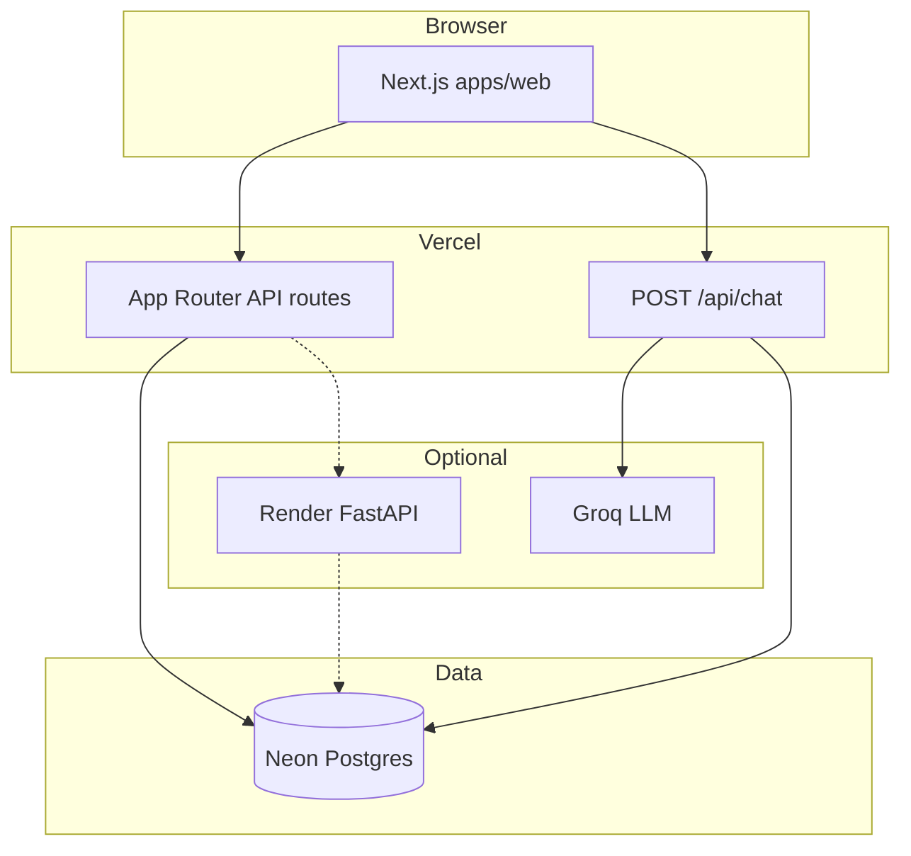

# Architecture Review — Reference

External frameworks and checklists synthesized for A Step Forward reviews.
Load this file when scoring NFRs or drafting ADR alternatives.

---

## 1. Research sources (2025–2026)

| Source | Use in reviews |
|--------|----------------|
| [Modular vs monolithic agents (Gen α AI, 2026)](https://genalphai.com/agent-architecture-showdown-modular-vs-monolithic-in-2026/) | Hybrid default: monolithic turn loop, modular tools/agents/MCP |
| [MLflow — Production-ready agents 2026](https://mlflow.org/articles/building-production-ready-ai-agents-in-2026/) | Decompose by deployable capability; governance as infrastructure |
| [arXiv 2602.10479 — Goal-directed agent architecture](https://arxiv.org/html/2602.10479v1) | Composable autonomy, typed contracts, service-mesh analogy for agents |
| [arXiv 2601.04748 — Skills vs multi-agent](https://arxiv.org/pdf/2601.04748) | Prefer skills over MAS when coordination overhead exceeds benefit; watch skill-library scaling limits |
| [arXiv 2602.20867 — SoK Agentic Skills](https://arxiv.org/html/2602.20867v1) | Skill design patterns, progressive disclosure, evaluation dimensions |
| [ARDURA architecture review checklist](https://ardura.consulting/blog/software-architecture-review-checklist/) | Scalability dimensions, anti-patterns, review scope |
| [BMAD ADR quality checklist (TEA)](https://github.com/bmad-code-org/bmad-method-test-architecture-enterprise/blob/main/src/agents/bmad-tea/resources/knowledge/adr-quality-readiness-checklist.md) | 8-category NFR/testability matrix |
| [Tech-stack.com — Architecture review process](https://tech-stack.com/blog/the-architecture-review-process/) | ADRs, dependency cliques, 14 quality attributes |
| [VibeRails — Microservices code review patterns](https://viberails.net/blog/microservices-code-review-communication-patterns) | Cross-service retries, contract drift, circuit breakers |

---

## 2. Architecture decision patterns (ASF)

### 2.1 Deployment topology (current target vs as-built)

| Pattern | When appropriate for ASF | Risks |
|---------|------------------------|-------|
| **Vercel monolith (Next.js)** | UI, auth, Neon-direct CRUD, chat streaming to Groq | Serverless cold start; long CPU; connection limits |
| **Render FastAPI (optional)** | LangGraph, Python agents, heavy RAG | Cold start; dual-path drift vs Neon-direct |
| **Postgres (Neon) SSOT** | Learner state, mastery, plans, chat turns | Connection pooling; migration discipline |
| **Workers (future)** | Dreaming, KG ingest, batch eval | Cron overlap; at-least-once delivery |
| **MCP servers** | Agent tool boundaries | Version skew with gateway |

**Review question:** Does this feature belong on the **Neon-direct critical path** or the **Python orchestration path**? Document if both exist.

### 2.2 Monolith vs services decision tree

```
Need Python LangGraph / embeddings / Celery?
  YES → service boundary at apps/api or services/*
  NO  → prefer apps/web API route + neon-db.ts

Need independent scale or deploy cadence?
  YES → extract only that capability; keep shared DB only with clear ownership
  NO  → keep in modular monolith (package boundaries, not network hops)

Need <300ms p95 on learner chat turn?
  YES → minimize sync hops; avoid chat → Render → Neon → Render chains
  NO  → async/event acceptable
```

### 2.3 Coupling anti-patterns (flag explicitly)

1. **Distributed monolith** — services that must deploy together.
2. **Shared database tables** — multiple writers without a single owner service.
3. **God module** — `neon-db.ts` or orchestrator absorbing unbounded domains (note when threshold crossed).
4. **Synchronous chains** — 3+ blocking calls on hot path (multiply latency + failure).
5. **Dual planners / dual sources of truth** — same concept, two algorithms (document drift).
6. **Schema without learner_id** — e.g. `quiz_responses` forces indirect activity signals.
7. **Mock fallbacks in production paths** — empty states OK; fabricated data not OK.

### 2.4 Concurrency & consistency checklist

| Check | Pass criteria |
|-------|----------------|
| Idempotency | Retries safe (UPSERT keys, idempotency tokens on POST) |
| Lost updates | Mastery/plan writes use version or atomic SQL, not read-modify-write races |
| Cron overlap | Weekly consolidate / plan regen guarded (lock row, advisory lock, or dedupe key) |
| Read-after-write | UI refresh uses `force-dynamic` or client revalidation after mutations |
| Eventual consistency | User-visible copy explains delay; no false "completed" states |
| Transaction scope | Multi-table learner updates in one transaction where failure must be atomic |

### 2.5 Scalability & resilience (NFR matrix)

Adapted from BMAD TEA + ARDURA:

| ID | Criterion | Review prompts |
|----|-----------|----------------|
| S1 | Stateless app tier | Session in Clerk/JWT; no in-memory learner state on server |
| S2 | DB bottlenecks | Pool size, Neon limits, N+1 in hot routes |
| S3 | Horizontal scale | Which components scale with instances vs single-writer |
| S4 | Graceful degradation | Render down → Neon path still works for onboarding/chat/plan |
| S5 | Circuit breakers | Groq/Render failures fail fast; no hung SSE |
| S6 | Rate limits | Per-learner and global on LLM + write endpoints |
| S7 | Backpressure | Queue depth for workers; chat concurrency caps |

### 2.6 Agent/skills architecture (product + dev)

- **Runtime agents** (`packages/agents/`) — bounded tool allowlists; eval gates.
- **Cursor sub-agents** — brief + skill; Composer 2.5 / Auto only.
- **Skills** — progressive disclosure; keep `SKILL.md` <5k tokens; REFERENCE for depth.
- **MCP** — tool surface for runtime; not a substitute for domain services.

When reviewing **dev workflow** architecture, apply skill-selection scaling lessons: prefer focused skills over mega-prompts; split when activation accuracy drops.

---

## 3. ADR quality gate

Before recommending **Accepted**:

- [ ] Context states problem + constraints (free tier, bilingual, COPPA-aware paths)
- [ ] ≥2 alternatives with rejection rationale
- [ ] ≥3 positive and ≥3 negative consequences
- [ ] Measurable verification (latency, test suite, migration step)
- [ ] Rollback / supersession path
- [ ] Stream owners tagged (01–10)

---

## 4. Mermaid snippets (reuse in assessments)

### Container view (simplified as-built)



---

## 5. ASF known open tensions (verify each review)

Track status in `docs/architecture/current-state.md`:

1. Two learning planners (`learning-plan.ts` vs Neon plan generator).
2. Neon-direct vs Render API duplication (`fetchDashboard`, legacy routes).
3. `quiz_responses` lacks `learner_id` — activity inferred via `concept_mastery`.
4. GraphRAG / Neo4j vs bundled `kg-data.json` on Vercel path.
5. Memory consolidation: lightweight web endpoint vs heavy Memory Steward vs cron sweep overlap.

---

## 6. Useful skills to cross-read

| Skill | Why |
|-------|-----|
| `neon-direct-route` | Critical-path boundary |
| `use-learning-plan` | Planner authority rules |
| `deploy` | CI/Vercel constraints |
| `coordinator-dispatch` | When findings need multi-stream work |
