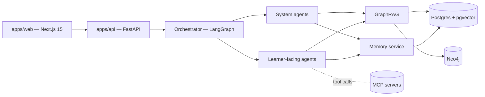

<!-- markdownlint-disable MD033 MD041 -->
<p align="center">
  
</p>

<h1 align="center">A Step Forward</h1>

<p align="center">
  <strong>An AI learning center that remembers you.</strong><br/>
  A small team of specialized agents teaches you, assesses you, remembers what you've
  learned, dreams on it overnight, and adapts.
</p>

<p align="center">
  <a href="LICENSE"></a>
  <a href="SECURITY.md"></a>
  <a href="https://github.com/RoeeHadar/A-Step-Forward/actions/workflows/lint-test.yml"></a>
  <a href="https://a-step-forward-waij.vercel.app"></a>
  
  
</p>

<p align="center">
  <a href="https://a-step-forward-waij.vercel.app"><strong>Live site</strong></a> ·
  <a href="docs/diagrams/architecture.md">Architecture</a> ·
  <a href="AGENTS.md">Agents</a> ·
  <a href="docs/adr/README.md">ADRs</a> ·
  <a href="docs/marketing/copy.md">Pitch</a>
</p>

---

> **A Step Forward** is an open-source, AI-native learning center where a coordinated team of
> specialized agents — Tutor, Mentor, Coach, Reviewer, Researcher — teaches you, assesses you,
> remembers what you've learned across sessions, and adapts. Built with Next.js 15, FastAPI,
> LangGraph, and a multi-layered memory system backed by Postgres + pgvector + Neo4j.
> The default language is **Hebrew (עברית)** with full RTL layout; English is available via the
> language switcher. MIT licensed, self-hostable, and eval-gated.
>
> **א צעד קדימה** הוא מרכז למידה מבוסס-בינה מלאכותית בקוד פתוח. צוות של סוכנים מתמחים — מורה,
> מנטור, מאמן, מבקר, חוקר — מלמד אתכם, מעריך אתכם, זוכר את מה שלמדתם לאורך שיחות, ומסתגל
> אליכם. ממשק ברירת המחדל הוא עברית עם פריסה מימין לשמאל. רישיון MIT, ניתן לאחסון עצמי.

---

## Why this exists

There is no shortage of "AI tutors" that are a single chatbot with a prompt. A
Step Forward is different: it is a **learning center** — a coordinated team of
specialised agents, a memory that compounds across sessions, and a personal
knowledge graph that grounds every answer in a source.

| | |
| --- | --- |
| **Agents, not a chatbot** | Tutor (Socratic), Mentor (goals & habits), Coach (drills, FSRS), Reviewer (code & essays), Researcher, Note-Taker, Engagement, Accessibility. Routed by a LangGraph orchestrator. |
| **Memory that compounds** | Episodic, semantic, procedural, and affective layers. A nightly _dreaming_ job consolidates, decays, and resolves conflicts. Every memory is inspectable + editable from the UI. |
| **Citations from your own KG** | Lessons, notes, and uploads are chunked, embedded, and resolved into a per-learner knowledge graph. GraphRAG hybrid retrieval (BM25 + dense + graph traversal + rerank) cites every claim. |
| **Eval-gated, not vibes-gated** | `promptfoo` + `DeepEval` matrices block any prompt or agent change in CI. New prompts ship in shadow mode for 24h before promotion. |
| **Privacy-first** | PII redaction (Presidio + custom rules), AES-GCM at rest, COPPA-aware child mode, per-row policies enforced server-side, audit logs on every memory read/write. |
| **Self-hostable** | `docker compose up` boots the whole stack. MIT licensed. |

## How it fits together



Full diagrams: [`docs/diagrams/architecture.md`](docs/diagrams/architecture.md),
[`docs/diagrams/graphrag.md`](docs/diagrams/graphrag.md).

## Quickstart (local)

You need Docker, Node 20+, pnpm 9.12+, Python 3.11+, and `uv`.

```bash
cp .env.example .env.local
make up               # Postgres + pgvector, Redis, Neo4j, Langfuse, MinIO, Mailhog, OTel collector
make migrate          # Alembic upgrade head across all services

# Backend
cd apps/api && uv sync && uv run uvicorn app.main:app --reload

# Frontend
cd apps/web && pnpm install && pnpm dev
```

Open <http://localhost:3000>, sign up via Clerk (dev keys in `.env.example`), and
chat with the Tutor. The deployed version is live at
<https://a-step-forward-waij.vercel.app>. Detailed walkthroughs:

- [`docs/infra/local-dev.md`](docs/infra/local-dev.md) — full stack, ports, restore drills.
- [`docs/infra/migrations.md`](docs/infra/migrations.md) — Alembic multi-head graph and `make migrate-check`.
- [`CONTRIBUTING.md`](CONTRIBUTING.md) — how sub-agents pick up work.

## Agent matrix

The agents themselves live in `packages/agents/` and their prompts under
`prompts/<agent>/`. The full contract is in
[`AGENTS.md`](AGENTS.md). Every agent must pass the eval suite at
`evals/agents/<agent>/` before it ships.

| Class | Agent | Model class | Notes |
| --- | --- | --- | --- |
| Learner-facing | Tutor | Claude Sonnet (Opus on deep) | Socratic, adaptive difficulty |
| Learner-facing | Mentor | Claude Sonnet | Goals, motivation, habits |
| Learner-facing | Coach | Claude Sonnet | Drills, FSRS reviews |
| Learner-facing | Q&A / Explainer | Claude Sonnet | Cited answers |
| Learner-facing | Reviewer | Claude Sonnet/Opus | Code · essay · solution |
| Learner-facing | Note-Taker | Claude Haiku/Sonnet | Cheap, frequent |
| Learner-facing | Engagement | GPT-mini / Haiku | Bulk nudges |
| Learner-facing | Accessibility | Gemini / Claude | Multimodal, multi-language |
| System | Orchestrator / Router | LangGraph | Routes turn-by-turn |
| System | Memory Steward (Dreamer) | Claude Sonnet | Nightly consolidation + decay |
| System | KG Builder | Claude Sonnet | Entity / relation extraction |
| System | Research | Claude Sonnet | Web + KG + RAG |
| System | Curriculum Designer | Claude Sonnet | Builds learner paths |
| System | Assessment Generator | Claude Sonnet | Quizzes, exercises, projects |
| System | Grader | Claude Sonnet | Rubric + LLM judge |
| System | Progress Analyzer | Claude Sonnet | Gap analysis, interventions |
| System | Content Curator | Claude Sonnet | Sources + ranks content |
| System | Safety / Moderation | Claude Sonnet | Pre/post filters |
| System | Eval Agent | Claude Sonnet | Runs eval suites |
| System | Analytics / Insights | Claude Sonnet | Educator/admin aggregates |

## Memory in one paragraph

Memories enter as structured `MemoryRecord` rows, redacted of PII, encrypted at
rest, and embedded into pgvector. They live in four layers — _episodic_
("today's tutoring session"), _semantic_ ("learner knows what a fraction is"),
_procedural_ ("learner solves long-division correctly"), _affective_ ("learner
gets frustrated by word problems"). A nightly Memory Steward agent
("dreaming") replays them, consolidates redundant entries, decays stale ones,
and resolves contradictions. Reads and writes are filtered by `learner_id`
from the auth context and audited. See
[`docs/adr/0002-memory-architecture.md`](docs/adr/0002-memory-architecture.md).

## Repo layout

```
apps/web         — Next.js 15 frontend (Tailwind v4 · shadcn/ui · Clerk)
apps/api         — FastAPI gateway (Pydantic v2 · SQLAlchemy 2 async)
services/        — memory · graphrag · orchestrator · workers
packages/        — agents · schemas · ui  (workspace packages)
mcp-servers/     — memory · graphrag · curriculum · progress
prompts/         — versioned agent prompts
evals/           — promptfoo + DeepEval suites
infra/           — docker-compose · Alembic · Fly tomls · OTel
skills/          — project-level Cursor skills for sub-agents
.cursor/         — rules · hooks · mcp.json · sub-agent briefs
docs/            — ADRs · diagrams · infra runbooks · marketing
```

## Tech stack at a glance

- **Frontend** — Next.js 15 (App Router) · TypeScript · Tailwind v4 · shadcn/ui · Vercel AI SDK · TanStack Query · Zustand · Clerk.
- **Backend** — FastAPI · Pydantic v2 · SQLAlchemy 2 async · Alembic · Celery / Arq.
- **Data** — Postgres 16 + pgvector · Redis (Upstash) · Neo4j AuraDB · Cloudflare R2.
- **AI** — LangGraph orchestration · Claude (primary) · GPT (fallback) · Gemini (multimodal) · Voyage embeddings · Cohere/Voyage rerank · Langfuse traces · promptfoo + DeepEval gating.
- **Ops** — Vercel (web) · Fly.io iad (api · workers · MCP) · Doppler (secrets) · Sentry · OTel.
- **Cursor** — Composer 2.5 / Auto sub-agents driven by `.cursor/subagent-briefs/`, with project skills under `skills/`.

## Security

See [`SECURITY.md`](SECURITY.md) for the disclosure policy and
[`docs/security/threat-model.md`](docs/security/threat-model.md) for the
threat model. Notable defaults:

- Per-row access control by `learner_id` from the auth context, never the body.
- COPPA-aware child mode when `learner.age < 13` or `learner.child_mode = true`.
- Tool-call allowlist per agent.
- Jailbreak defense + moderation classifier on every input.

## Contributing

Read [`CONTRIBUTING.md`](CONTRIBUTING.md). Every PR runs `review-bugbot`;
PRs touching `auth`/`memory`/`graphrag`/RBAC/payments also run `review-security`.
Conventional Commits, MIT license, no flaky tests merged.

## License

MIT © 2026 Roee Hadar — see [`LICENSE`](LICENSE).
