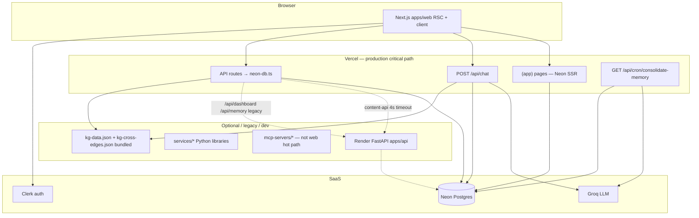

# Architecture Assessment: Platform Overview

- **Date:** 2026-07-05
- **Author:** Architecture Steward (Cursor sub-agent)
- **Status:** Final
- **Scope:** Platform overview — topology, coupling, scalability, concurrency, operability, evolution
- **Related ADRs:** [ADR-001](../adr/001-hosting.md) (partially superseded in practice), [ADR-0002](../adr/0002-memory-architecture.md), [ADR-0004](../adr/0004-llm-provider-groq.md), [ADR-0005](../adr/0005-embeddings-sentence-transformers.md)

---

## Executive summary

A Step Forward runs today as a **Vercel modular monolith** (Next.js 15 + Neon-direct API routes + Groq streaming) with Neon Postgres as the learner state system of record. The **target** architecture in `PLAN.md` / `ARCHITECTURE.md` — FastAPI gateway, Python domain services, Redis, Neo4j, Celery workers — exists in-repo but is **not on the production critical path** for signup → study → chat.

The highest-impact architectural tension is **dual learning planners**: mastery-aware KG walking (`buildLearningPlan`) powers agents and `/api/learning-plan/next`, while template weekly plan persistence (`generateLearningPlan`) powers dashboard, onboarding, and plan apply. Learners and agents can see different “next steps” for the same goal.

Secondary risks: **Neon-direct vs Render drift** (legacy proxy routes and content fallback), **consolidation/plan-write races** without locks or transactions, **observability gaps** on the web hot path (stdout logger only), and **ADR drift** (ADR-001 still describes Render as primary API while Neon-direct is the documented critical-path principle).

**Top recommendation:** Unify plan generation behind `buildLearningPlan` with an ADR for authority rules; in parallel, retire Render proxies on `/api/dashboard` and `/api/memory` (one-session, low-risk).

---

## Context & goals

### Questions this review answers

1. What actually runs in production vs what `PLAN.md` describes?
2. Where is coupling tight enough to block parallel stream work or cause drift?
3. What breaks first under 3× / 10× traffic on free tier?
4. Which races can corrupt learner-visible state?
5. How operable is deploy/rollback/observability today?
6. What ADR and skill-boundary debt should the Coordinator schedule?

### Explicit non-goals

- Product learning-path UX design (see `.cursor/subagent-briefs/14-adaptive-learning-architecture.md`, `obsidian-vault/curriculum/learning-path-architecture.md`).
- Curriculum content quality, lesson expansion, or eval thresholds.
- Security penetration testing (stream **10-security-safety** owns execution).
- Implementing refactors — this document proposes and sequences only.

### Constraints

- Free tier: Vercel + Neon + Groq; Render optional accelerator.
- Auth: Clerk JWT; `userId` = `learner_id`; never trust client `learner_id` on reads.
- Bilingual HE-default; math LTR in `$...$` / `$$...$$`.
- Neon-direct critical path must survive Render absence (`.cursor/skills/neon-direct-route/SKILL.md`).

---

## Current architecture (as-built)

### Container diagram



### Hot paths traced

| Path | Entry | Stores / deps | Sync hops |
|------|-------|---------------|-----------|
| **Chat turn** | `apps/web/src/app/api/chat/route.ts` | Groq stream; Neon: `chat_turns`, `learner_agent_notes`, persona, mastery, plan read; bundled KG JSON | Browser → Vercel → Groq + Neon (parallel reads, then stream) |
| **Weekly plan (DB)** | `generateLearningPlan()` in `neon-db.ts`; callers: `plan-apply.ts`, `/api/plans/generate` | Neon: `learning_plans`, `plan_weeks` (DELETE+INSERT) | Vercel → Neon |
| **Next step (KG)** | `buildLearningPlan()` in `learning-plan.ts`; callers: chat route, `/api/learning-plan/next` | Neon: `concept_mastery`, `skill_practice`; in-memory KG | Vercel → Neon + JSON |
| **Lesson answer** | `/api/lesson/answer` → `recordLessonAnswer()` | Neon: `quiz_responses`, `concept_mastery`, `skill_practice` | Vercel → Neon |
| **Progress / dashboard UI** | `(app)/app/page.tsx`, `(app)/app/progress/page.tsx` | Neon direct: `getCurrentPlan`, `getProgressFromNeon`, etc. | Vercel → Neon |
| **Memory UI** | `(app)/app/memory/page.tsx` → `getLearnerMemorySnapshot()` | Neon direct | Vercel → Neon |
| **Legacy dashboard API** | `/api/dashboard` → `fetchDashboard()` → Render `/v1/dashboard` | Render optional; empty mock fallback | Vercel → Render? |
| **Legacy memory API** | `/api/memory` → `fetchMemories()` → Render `/v1/memory/timeline` | Render optional; `[]` fallback | Vercel → Render? |
| **Consolidation** | `/api/agent-memory/consolidate`, `/api/cron/consolidate-memory` | Groq JSON; Neon persona + note archive | Vercel → Groq + Neon |

**Evidence — chat is Neon-direct, no Render:**

```375:377:apps/web/src/app/api/chat/route.ts
  // Direct Groq path — no Render dependency. Designed to fit comfortably
  // inside Vercel function timeouts.
```

**Evidence — dashboard page is Neon-direct:**

```37:52:apps/web/src/app/(app)/app/page.tsx
  const [profile, goalStatus, plan, streak, latestPlanChange] = await Promise.all([
    dbConfigured
      ? getLearnerProfile(auth.learnerId).catch(() => null)
      : Promise.resolve(null),
    ...
      ? getCurrentPlan(auth.learnerId).catch(() => null)
```

### Data ownership

| Entity | Source of truth | Writers | Readers |
|--------|-----------------|---------|---------|
| `learner_profiles` | Neon | Onboarding, `applyPlanProfileUpdates` | All agents via chat context |
| `learning_plans` / `plan_weeks` | Neon | `generateLearningPlan`, onboarding | Dashboard, Tutor sidebar apply, chat `getCurrentPlan` |
| `concept_mastery` / `skill_practice` | Neon | Diagnostic, lesson answer, grader paths | Planners, progress, agents |
| `chat_turns` | Neon | Chat route | Agents (recent turns) |
| `learner_agent_notes` | Neon | Agents, dream/consolidate | Owning agent, consolidator |
| `learner_profiles.learner_persona` | Neon | Consolidate, manual edit | Every agent turn |
| `quiz_responses` | Neon | `recordLessonAnswer`, diagnostic | **Not learner-scoped** — no `learner_id` column |
| KG topology | Repo JSON (`kg-data.json`, `kg-cross-edges.json`) | Build scripts / vault pipeline | `learning-plan.ts`, chat baseline |
| Python `services/*` memory/graphrag | Not production SSOT for web | Dev / future workers | Not on learner hot path |

**Schema evidence — `quiz_responses` lacks `learner_id`:**

```151:160:infra/alembic/versions/0010_learner_model.py
        CREATE TABLE IF NOT EXISTS quiz_responses (
            id            UUID PRIMARY KEY DEFAULT gen_random_uuid(),
            quiz_id       UUID NOT NULL,
            quiz_type     TEXT NOT NULL,
            item_id       UUID NOT NULL REFERENCES diagnostic_items(id),
            chosen        TEXT NOT NULL,
            correct       BOOLEAN NOT NULL,
            ...
```

Documented mitigation in `neon-db.ts` lines 1944–1948: paired `concept_mastery.last_activity` upsert.

---

## Findings

| ID | Severity | Category | Finding | Evidence | Failure scenario |
|----|----------|----------|---------|----------|------------------|
| F1 | **P1** | Coupling | **Dual planners** — DB weekly generator vs KG mastery planner | `neon-db.ts:527` `generateLearningPlan`; `learning-plan.ts:185` `buildLearningPlan`; chat injects latter (`chat/route.ts:646`) while dashboard uses former via `getCurrentPlan` | Tutor tells learner to study concept A (KG path); dashboard week list shows concept B (template round-robin) |
| F2 | **P1** | Race | **Plan regen is DELETE+INSERT without a transaction** | `neon-db.ts:620-625` | Two concurrent plan applies (chat + sidebar): learner ends with no active plan or partial `plan_weeks` |
| F3 | **P1** | Race | **Consolidation has no per-learner lock** | `persona-consolidator.ts:156-214`; manual route `consolidate/route.ts:31`; cron `cron/consolidate-memory/route.ts:57` | User clicks “Rebuild from notes” during weekly cron: last-write-wins persona, notes archived inconsistently |
| F4 | **P2** | Coupling | **Neon-direct vs Render drift** — legacy proxy routes remain | `data.ts:64-123`; `/api/dashboard/route.ts`; `/api/memory/route.ts`; vs Neon snapshots in pages | Client hook or future UI wired to `/api/memory` sees empty timeline while `/app/memory` shows real notes |
| F5 | **P2** | Coupling | **`neon-db.ts` god module (~3,126 lines)** | `apps/web/src/lib/neon-db.ts` | Any schema change requires editing a single file; high merge conflict rate across streams |
| F6 | **P2** | Race | **Duplicate cron triggers** — Vercel cron + GitHub Actions same schedule | `apps/web/vercel.json:9-13`; `.github/workflows/cron-consolidate-memory.yml:9-11` | Double Groq spend; amplified F3 overlap on same learner batch |
| F7 | **P2** | Scale | **Chat/consolidation bounded by Vercel `maxDuration=60`** | `chat/route.ts:47`; `consolidate-memory/route.ts:27` | Long Groq stalls or many DB reads → truncated stream or 504 on Hobby (10s non-streaming ceiling noted in chat comments) |
| F8 | **P2** | Ops | **Web observability is stdout JSON only — no Sentry/Langfuse on chat path** | `logger.ts:7-13`; FastAPI has `configure_sentry` in `apps/api/app/main.py:52` | Production chat failures invisible except Vercel logs; no trace of LLM latency/cost per learner |
| F9 | **P2** | Evolution | **ADR drift — ADR-001 Render-primary vs Neon-direct critical path** | `docs/adr/001-hosting.md`; `.cursor/skills/neon-direct-route/SKILL.md`; `current-state.md` | New contributors proxy features to Render contradicting free-tier policy |
| F10 | **P2** | Data | **`quiz_responses` not learner-scoped** | Migration `0010`; `neon-db.ts:1944-1948` | Analytics on raw quiz rows impossible; streak/progress relies on transitive mastery signal |
| F11 | **P3** | Cache | **`content-api.ts` caches Render fallback 300s** | `content-api.ts:24-26` | `/learn` section metadata stale up to 5 min when Neon miss falls back to Render |
| F12 | **P3** | Coupling | **Educator/admin pages still use mock fallbacks** | `data.ts:35-62`, `educator/page.tsx`, `admin/page.tsx` | Demo data shown when Render unavailable — acceptable for non-launch surfaces |
| F13 | **P3** | Evolution | **Unused TanStack hooks still target legacy APIs** | `hooks/use-learner-data.ts` (no importers in `apps/web`) | Dead code path; risk if reintroduced without Neon migration |

**P0 blockers:** None identified in this review. No auth-bypass or unbounded cascade on the Neon-direct happy path. F1–F3 are **P1** with plausible user-visible inconsistency or state loss under concurrency.

---

## Options analysis

### Theme 1: Topology (monolith vs services)

| Option | Description | Pros | Cons | Effort | Recommendation |
|--------|-------------|------|------|--------|----------------|
| A | **Do nothing** — keep Vercel monolith + optional Render | Matches current scale; zero migration cost | PLAN/ARCHITECTURE docs mislead; Python services untested in prod | None | Acceptable short-term |
| B | **Minimal** — document as-built; mark Render “accelerator only” | Aligns docs with reality; no deploy change | Does not unlock LangGraph/Python agents in prod | Low (**24**, **09-infra**) | **Do now** |
| C | **Structural** — deploy `apps/api` + workers per PLAN | Full agent orchestration, GraphRAG, Celery | Free-tier cold starts; dual-path maintenance; team parallelism needed | High (**02**, **04**, **05**, **09**) | Defer until planner unification + observability |

**Recommended:** Option B now; Option C only when a feature **requires** Python-only logic on the hot path (embeddings pipeline, LangGraph router).

---

### Theme 2: Dual planners (F1)

| Option | Description | Pros | Cons | Effort | Recommendation |
|--------|-------------|------|------|--------|----------------|
| A | **Do nothing** | No migration risk | Permanent agent/UI divergence | None | Not acceptable past next milestone |
| B | **Minimal** — `generateLearningPlan` calls `buildLearningPlan` for ordering, then persists weeks | Single algorithm for “what’s next”; aligns with `obsidian-vault/_active-context.md` priority #1 | DB week shape may not match path nodes; tests must cover | Medium (**07-curriculum**, **01-frontend**) | **Preferred** |
| C | **Structural** — deprecate `plan_weeks` template model; store planner output as canonical | Clean SSOT | Breaking change to dashboard/quiz week UX | High (**07**, **01**, ADR) | After B proves stable |

**Recommended:** Option B with ADR defining **planner authority** (`buildLearningPlan` computes order; `generateLearningPlan` only persists + hydrates UI metadata).

---

### Theme 3: Neon-direct vs Render drift (F4, F9)

| Option | Description | Pros | Cons | Effort | Recommendation |
|--------|-------------|------|------|--------|----------------|
| A | **Do nothing** | Legacy routes harmless if unused | Drift accumulates | None | Weak |
| B | **Minimal** — rewire `/api/dashboard`, `/api/memory` to `getDashboardSnapshot` / `getMemoryTimelineFromNeon`; delete unused hooks or update them | One-session fix; removes silent empty fallbacks | Must validate response schemas | Low (**01-frontend**) | **Do now** |
| C | **Structural** — remove Render deploy + `NEXT_PUBLIC_API_BASE_URL` from prod | Cost/complexity down | Loses Python API sandbox for dev | Medium (**09-infra**, ADR supersedes ADR-001) | After B + content fully Neon |

**Recommended:** Option B immediately; propose ADR to supersede ADR-001 “Render primary” language.

---

### Theme 4: Concurrency — consolidation & cron (F3, F6)

| Option | Description | Pros | Cons | Effort | Recommendation |
|--------|-------------|------|------|--------|----------------|
| A | **Do nothing** | Rare overlap | Persona/note corruption possible | None | Weak |
| B | **Minimal** — Postgres advisory lock per `learner_id` in `consolidateLearnerMemory`; single cron trigger (GHA **or** Vercel) | Cheap, strong correctness | Slight cron latency if lock contended | Low (**04-memory**, **09-infra**) | **Do now** |
| C | **Structural** — queue consolidation jobs (Redis/Celery) with dedupe keys | Scales to many learners | Overkill on free tier | High (**04**, **09**) | Defer |

**Recommended:** Option B.

---

### Theme 5: Plan apply atomicity (F2)

| Option | Description | Pros | Cons | Effort | Recommendation |
|--------|-------------|------|------|--------|----------------|
| A | **Do nothing** | Works in happy path | Plan loss on concurrent apply | None | Weak |
| B | **Minimal** — wrap DELETE+INSERT in single Neon transaction; optional `plan_version` column | Prevents torn state | Migration if versioning added | Low (**01-frontend** or **02-backend-api** pattern in TS) | **Do now** |
| C | **Structural** — append-only plan history with active pointer | Audit trail | More schema/UI work | Medium (**07**) | Later |

**Recommended:** Option B.

---

### Theme 6: Scalability (F7, free tier)

| Option | Description | Pros | Cons | Effort | Recommendation |
|--------|-------------|------|------|--------|----------------|
| A | **Do nothing** | Fine for current users | Groq/Neon rate limits hit under growth | None | OK < ~100 DAU |
| B | **Minimal** — cap concurrent chat DB fan-out; Groq circuit breaker already partial in `llm-provider.ts` | Graceful degradation | Less context richness | Low (**01**) | Monitor first |
| C | **Structural** — move chat orchestration to long-lived worker / edge streaming split | Beats 60s cap | Major architecture change | High | At 10× traffic |

**Scalability outlook:**

- **3× traffic:** Groq rate limits and Neon HTTP connection churn likely first (`neonConfig.fetchConnectionCache = true` in multiple modules). Chat route runs 6+ parallel Neon reads per turn (`chat/route.ts:417-424`).
- **10× traffic:** Vercel concurrent function limit + Groq TPM; SSE chat fan-out costly.
- **First bottleneck:** Groq quotas, then Neon read amplification on chat context build.

---

### Theme 7: Operability & observability (F8)

| Option | Description | Pros | Cons | Effort | Recommendation |
|--------|-------------|------|------|--------|----------------|
| A | **Do nothing** | Vercel logs exist | No alerting, no LLM traces | None | Weak |
| B | **Minimal** — Sentry for `apps/web` API routes; structured `logger.error` → Sentry | Fast incident response | Another SaaS dependency | Low (**01**, **09**) | **Do soon** |
| C | **Structural** — Langfuse on chat path per PLAN | Full LLM eval loop | Self-host cost/complexity | Medium (**03-agents**, **09**) | Post-Sentry |

**Rollback today:** `git revert` + push; `scripts/verify-deploy.ps1` per `.cursor/rules/65-deploy-vercel.mdc`. Render/API rollback independent but non-critical for learner loop.

---

### Theme 8: Evolution — ADR & skill boundaries (F5, F9)

| Option | Description | Pros | Cons | Effort | Recommendation |
|--------|-------------|------|------|--------|----------------|
| A | **Do nothing** | — | God module grows; ADR confusion | None | Weak |
| B | **Minimal** — split `neon-db.ts` by domain when touched (`neon-plans.ts`, `neon-mastery.ts`); Proposed ADR for Neon-direct + planner authority | Incremental relief | Import graph churn | Medium per slice (**01**, **24**) | **Ongoing rule** |
| C | **Structural** — code-generated SQL layer or move writes to Python service | Strong boundaries | Violates free-tier Neon-direct policy | High | Reject for now |

**Skill boundary note:** `neon-direct-route/SKILL.md` mandates all SQL in `neon-db.ts`, which fights modularization — update skill to allow `neon-*.ts` siblings with re-export barrel.

---

## Concurrency & consistency notes

- **Idempotency:** Mastery writes use UPSERT (`neon-db.ts:134-136`). Consolidation archives by explicit note IDs with validation (`persona-consolidator.ts:199-205`). Plan generation is **not** idempotent (destructive DELETE first).
- **Cron / worker overlap:** Vercel + GHA both fire Sunday 03:00 UTC. Cron processes up to 25 learners per invocation with no cross-invocation lock (`cron-consolidate-memory/route.ts:47-51`).
- **Caching / staleness:** Root `layout.tsx:20` sets `export const dynamic = 'force-dynamic'` — most RSC pages inherit dynamic rendering. Exception: `content-api.ts` uses `revalidate: 300` for Render content fallback (F11). `(app)/app/memory/page.tsx` has no local `force-dynamic` but inherits root.

---

## Proposed ADRs (if any)

| Proposed ADR | Title | Decision summary |
|--------------|-------|------------------|
| ADR-0006 (proposed) | Neon-direct critical path | Vercel API routes + Neon are SSOT for learner loop; Render is dev/accelerator only; supersedes ADR-001 wording |
| ADR-0007 (proposed) | Learning planner authority | `buildLearningPlan` is authoritative for sequencing; `generateLearningPlan` persists its output to `learning_plans` / `plan_weeks` |

---

## Sequenced roadmap

1. **IMPLEMENT-NOW:** Rewire `/api/dashboard`, `/api/memory` to Neon snapshots (**01-frontend**).
2. **IMPLEMENT-NOW:** Advisory lock + single cron owner for consolidation (**04-memory**, **09-infra**).
3. **IMPLEMENT-NOW:** Transaction-wrap `generateLearningPlan` persistence (**01-frontend**).
4. **ADR + DISPATCH:** Planner unification — `generateLearningPlan` → `buildLearningPlan` (**07-curriculum**, **24**).
5. **IMPLEMENT-NOW:** Sentry on web API routes (**01-frontend**, **09-infra**).
6. **ADR:** Neon-direct supersedes ADR-001 partial (**24**).
7. **DISPATCH:** Incremental `neon-db.ts` split + skill update (**01-frontend**, **24**).
8. **Backlog:** `quiz_responses.learner_id` migration (**02-backend-api** / **09-infra** alembic).

### Suggested owners

| Item | Stream / brief |
|------|----------------|
| Legacy API → Neon | `.cursor/subagent-briefs/01-frontend.md` |
| Planner unification | `.cursor/subagent-briefs/07-curriculum.md` |
| Consolidation locks | `.cursor/subagent-briefs/04-memory.md` |
| Cron dedupe | `.cursor/subagent-briefs/09-infra.md` |
| ADR drafts | `.cursor/subagent-briefs/24-architecture-steward.md` |
| `quiz_responses` migration | `.cursor/subagent-briefs/02-backend-api.md` + **09-infra** |
| Sentry / deploy observability | `.cursor/subagent-briefs/09-infra.md` |
| Security review on auth paths | `.cursor/subagent-briefs/10-security-safety.md` (if RBAC surfaces touched) |

---

## Coordinator action list

Ranked by impact ÷ effort; tag indicates dispatch mode.

| Rank | Action | Tag | Owner |
|------|--------|-----|-------|
| 1 | Rewire `/api/dashboard` + `/api/memory` to Neon snapshot functions | **IMPLEMENT-NOW** | 01-frontend |
| 2 | Add per-learner advisory lock in `consolidateLearnerMemory`; pick Vercel **or** GHA cron (not both) | **IMPLEMENT-NOW** | 04-memory, 09-infra |
| 3 | Wrap `generateLearningPlan` DELETE+INSERT in one SQL transaction | **IMPLEMENT-NOW** | 01-frontend |
| 4 | Draft ADR-0007 planner authority; spike `generateLearningPlan` calling `buildLearningPlan` | **ADR** | 24 → 07-curriculum |
| 5 | Implement planner unification + integration tests (`plan-neon.integration.test.ts`) | **DISPATCH-07** | 07-curriculum, 01-frontend |
| 6 | Draft ADR-0006 Neon-direct; update ADR-001 status to “partially superseded” | **ADR** | 24 |
| 7 | Wire Sentry (or equivalent) for `apps/web` API `logger.error` | **IMPLEMENT-NOW** | 01-frontend, 09-infra |
| 8 | Alembic migration: add `learner_id` to `quiz_responses` + backfill from session context | **DISPATCH-02** | 02-backend-api, 09-infra |

**Safe in one session:** ranks 1–3, 7.  
**Needs ADR before merge:** ranks 4, 6.  
**Needs multi-stream dispatch:** ranks 5, 8.

---

## Verification plan

- [ ] Extend `plan-neon.integration.test.ts` — planner unification produces same week order as `/api/learning-plan/next` for fixed fixture learner.
- [ ] Concurrency test: parallel `consolidateLearnerMemory` calls → second waits or no-ops cleanly.
- [ ] Plan apply stress: two rapid applies → exactly one active plan remains.
- [ ] Metrics: Sentry error rate on `/api/chat`; Groq latency p95 from structured logs.
- [ ] Rollback: revert PR; run `scripts/verify-deploy.ps1`; confirm `/app`, `/learn`, chat stream.

---

## References

- `docs/architecture/current-state.md`
- `PLAN.md` §2–3, `ARCHITECTURE.md`
- `obsidian-vault/_active-context.md`
- `.cursor/skills/architecture-review/SKILL.md`, `REFERENCE.md`
- `.cursor/skills/neon-direct-route/SKILL.md`, `.cursor/skills/use-learning-plan/SKILL.md`
- `.cursor/skills/deploy/SKILL.md`
- ADR index: `docs/adr/README.md`
