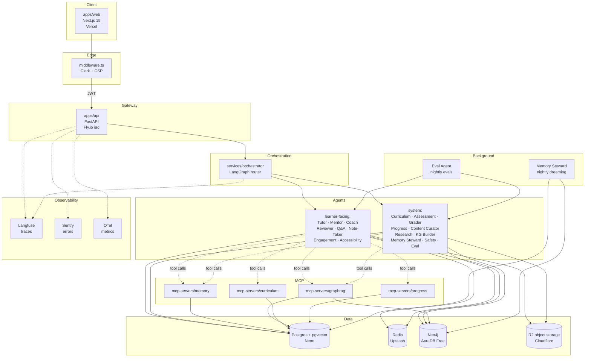

# Architecture overview

```mermaid
flowchart TB
    subgraph Client
      WEB[apps/web<br/>Next.js 15<br/>Vercel]
    end

    subgraph Edge
      MW[middleware.ts<br/>Clerk + CSP]
    end

    WEB --> MW

    subgraph Gateway
      API[apps/api<br/>FastAPI<br/>Fly.io iad]
    end

    MW -->|JWT| API

    subgraph Orchestration
      ORCH[services/orchestrator<br/>LangGraph router]
    end

    API --> ORCH

    subgraph Agents
      LF[learner-facing:<br/>Tutor · Mentor · Coach<br/>Reviewer · Q&A · Note-Taker<br/>Engagement · Accessibility]
      SYS[system:<br/>Curriculum · Assessment · Grader<br/>Progress · Content Curator<br/>Research · KG Builder<br/>Memory Steward · Safety · Eval]
    end

    ORCH --> LF
    ORCH --> SYS

    subgraph Data
      PG[(Postgres + pgvector<br/>Neon)]
      RD[(Redis<br/>Upstash)]
      NEO[(Neo4j<br/>AuraDB Free)]
      R2[(R2 object storage<br/>Cloudflare)]
    end

    LF --> PG
    LF --> RD
    LF --> NEO
    LF --> R2
    SYS --> PG
    SYS --> RD
    SYS --> NEO
    SYS --> R2

    subgraph MCP
      MMEM[mcp-servers/memory]
      MGRAG[mcp-servers/graphrag]
      MCURR[mcp-servers/curriculum]
      MPROG[mcp-servers/progress]
    end

    LF -.->|tool calls| MMEM
    LF -.->|tool calls| MGRAG
    LF -.->|tool calls| MCURR
    LF -.->|tool calls| MPROG
    SYS -.->|tool calls| MMEM
    SYS -.->|tool calls| MGRAG

    MMEM --> PG
    MGRAG --> PG
    MGRAG --> NEO
    MCURR --> PG
    MPROG --> PG

    subgraph Observability
      LF_OBS[Langfuse<br/>traces]
      SENTRY[Sentry<br/>errors]
      OTEL[OTel<br/>metrics]
    end

    API -.-> LF_OBS
    API -.-> SENTRY
    API -.-> OTEL
    ORCH -.-> LF_OBS

    subgraph Background
      DREAM[Memory Steward<br/>nightly dreaming]
      EVAL[Eval Agent<br/>nightly evals]
    end

    DREAM --> PG
    DREAM --> NEO
    EVAL --> LF
    EVAL --> SYS
```

For details see `ARCHITECTURE.md` and `PLAN.md` §3–§7.
