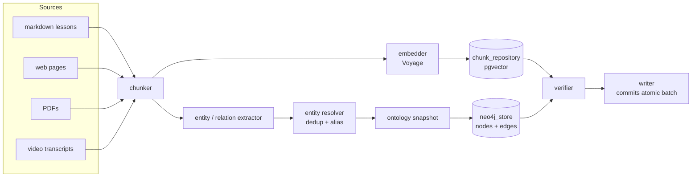
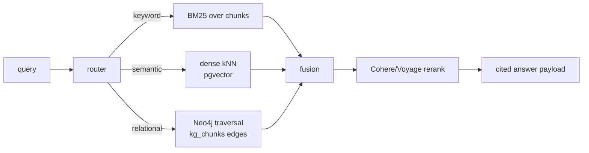

# GraphRAG — data flow

Hybrid retrieval over a per-learner knowledge graph. Ingestion is a deterministic
pipeline; retrieval is a routed mix of BM25, dense, and graph traversal,
followed by a Cohere/Voyage rerank.

## Ingestion

## Retrieval (`kg.hybrid`)

## Stores

- `chunks`: Postgres + pgvector (per-learner, scoped by `learner_id`).
- `kg_chunks`: link table between Neo4j entities and chunk IDs
  (`infra/alembic/versions/0002_kg_chunks.py`).
- Neo4j: AuraDB Free in prod; `neo4j` Compose service locally.
- Ontology snapshots are versioned in `infra/alembic/versions/`.

## SLO targets (Phase-1)

- p50 ingestion: ≤ 5s / 5k tokens.
- p95 retrieval (warm cache): ≤ 350ms.
- Recall@10 (math seed corpus): ≥ 0.85.
- Precision@10 (math seed corpus): ≥ 0.65.

Live thresholds live in `evals/retrieval/kg/thresholds.yaml`.
