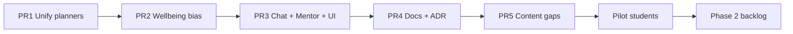

# Adaptive wellbeing integration — execution checklist

> **Authority:** [ADR-0008](../adr/0008-adaptive-wellbeing-planning.md)  
> **Pilot:** ~tens of learners, Bagrut-heavy (new curriculum), ages typically 16–18  
> **Infra assumption:** All services on free tier; no paid-tier hedge required for dreaming/consolidation frequency.

Use this checklist for Phase 1 PRs. Each item includes **acceptance criteria** checkboxes for merge gates.

---

## Phase 1 — Pilot-ready integration

### PR 1: Unify planners (ADR-0007 implementation)

**Goal:** One sequencing engine; dashboard weeks are persistence of the same path chat uses.

| # | Task | Acceptance criteria |
| --- | --- | --- |
| 1.1 | Refactor `generateLearningPlan()` to call `buildLearningPlan()` (or shared core) for concept ordering | - [ ] Week concept lists derive from same BFS + cross-edge walk as chat snapshot |
| 1.2 | Preserve calendar logic (week count from `next_test_date` / `final_goal_date`, round-robin chunking) | - [ ] `numWeeks` clamps unchanged (1–12 test / 2–24 goal / default 4) |
| 1.3 | Include cross-subject edges in worklist expansion | - [ ] `kg-cross-edges.json` relations `prereq`, `generalizes`, `applies_to` used in weekly worklist |
| 1.4 | Add `plan_schema_version` to `learning_plans` | - [ ] Migration or column add documented; bump triggers regen on next login |
| 1.5 | Integration tests | - [ ] `plan-neon.integration.test.ts`: active week top concepts match `/api/learning-plan/next` for fixture learner |
| 1.6 | Regen safety | - [ ] Pilot-only regen path tested; no silent overwrite without version bump |

**Files (expected touch):** `learning-plan.ts`, `neon-db.ts`, `plan-apply.ts`, migration, integration tests.

---

### PR 2: Morale planner + wellbeing bias module

**Goal:** Server-side morale selection, internal state, gated persisted rewrites.

| # | Task | Acceptance criteria |
| --- | --- | --- |
| 2.1 | Create `wellbeing-plan-bias.ts` (or equivalent) | - [ ] Exports: `evaluateSignals()`, `selectMoraleConcepts()`, `applyWellbeingOverlay()`, `canPersistRewrite()` |
| 2.2 | Store `wellbeing_plan_bias` JSON on learner profile (or dedicated table) | - [ ] Readable by Mentor context builder; not learner-editable as raw mechanism |
| 2.3 | Implement `selectMoraleConcepts()` | - [ ] Strength ≥ 0.7 (or top-N fallback); 1-hop neighbors; filtered by `goal_key` / `points_group` |
| 2.4 | Blend ratio when bias active | - [ ] ~60% goal-critical / ~40% morale-adjacent in active week (config constant) |
| 2.5 | Two-layer replanning | - [ ] Internal bias updates immediately on signal change |
| 2.6 | Cooldown: wellbeing-class triggers | - [ ] Min 72h between wellbeing rewrites; max 2/week |
| 2.7 | **Mastery-shock exemption** | - [ ] Mastery-shock rewrites **do not consume** weekly cap of 2 |
| 2.8 | Minimum spacing | - [ ] Any two persisted rewrites ≥ 24h apart (anti same-day thrash) |
| 2.9 | Exam window | - [ ] ≤14d entry triggers once per window; ≤7d may bypass 72h cooldown once |
| 2.10 | Audit fields | - [ ] `plan_last_adjusted_at`, `plan_adjustment_kind` persisted |
| 2.11 | Hook points | - [ ] Replan on: profile save (anxiety), mastery update, exam date change, optional cron sweep |
| 2.12 | Unit tests | - [ ] Cooldown cap exhausted + mastery shock still rewrites; anxiety 6→7 no rewrite |

**Files (expected touch):** new `wellbeing-plan-bias.ts`, `neon-db.ts`, profile API routes, tests.

---

### PR 3: Anxiety injection fix + Mentor ownership + dashboard notice

**Goal:** Chat and dashboard align with wellbeing policy; agents know ownership.

| # | Task | Acceptance criteria |
| --- | --- | --- |
| 3.1 | Fix `exam_anxiety` in `learner-chat-intent.ts` | - [ ] `injectLearningPlanSnapshot: true` |
| 3.2 | Replace improvised-gap instruction | - [ ] Turn instruction uses server-selected concepts + soft framing |
| 3.3 | Mentor skills / persona | - [ ] Mentor owns wellbeing notes; documented in `web-agent-mentor` skill + `agent-skills.ts` |
| 3.4 | Tutor execution | - [ ] Tutor receives snapshot; does not own replan logic |
| 3.5 | Dashboard neutral notice | - [ ] Copy shown on server-driven change (HE + EN) |
| 3.6 | Onboarding consent line | - [ ] One-line informed consent for stress/anxiety use in plan adjustment |
| 3.7 | Chat route wiring | - [ ] `wellbeing_plan_bias` + snapshot injected when bias active |
| 3.8 | Intent + profile anxiety | - [ ] Profile anxiety ≥ 7 affects bias even without chat trigger |
| 3.9 | Tests | - [ ] `learner-chat-intent.test.ts` updated for snapshot injection |

**Files (expected touch):** `learner-chat-intent.ts`, `chat/route.ts`, `agent-skills.ts`, dashboard plan UI, onboarding copy.

---

### PR 4: Doc reconciliation + ADR acceptance

**Goal:** Cursor agents and contributors read accurate runtime behavior.

| # | Task | Acceptance criteria |
| --- | --- | --- |
| 4.1 | Accept ADR-0008; update ADR index | - [ ] `docs/adr/README.md` lists 0008 |
| 4.2 | Mark ADR-0007 implemented (or superseded by 0008) | - [ ] Status updated with cross-link |
| 4.3 | Update `skills/use-learning-plan/SKILL.md` | - [ ] Single planner; wellbeing overlay documented |
| 4.4 | Update `skills/chat-memory-context/SKILL.md` | - [ ] 4-turn memory, compact baseline, no Render fallback |
| 4.5 | Update `skills/web-agent-mentor/SKILL.md` | - [ ] Wellbeing ownership + server replan exception |
| 4.6 | Update `obsidian-vault/_active-context.md` | - [ ] Golden path + wellbeing marked shipped or in-progress accurately |
| 4.7 | Update `learning-path-architecture.md` gaps | - [ ] Strike unified planner; add wellbeing module |
| 4.8 | Deprecate unused lesson schema fields (optional) | - [ ] ADR note or TSDoc: `level_focus` deprecated; separate-file-per-track is standard |

---

### PR 5: Content gaps (pilot-prioritized)

**Goal:** New Bagrut tracks have lessons for pilot-critical concepts only.

| # | Task | Acceptance criteria |
| --- | --- | --- |
| 5.1 | Audit `curriculum-categories.ts` vs `scripts/seed_data/lessons/` for **372 / 471 / 572** scope | - [ ] Gap list documented in vault or issue |
| 5.2 | Author missing **372-only** lessons (priority) | - [ ] `linear_programming_two_variables`, `spatial_reasoning`, etc. if in pilot scope |
| 5.3 | Fix empty physics lab `concept_ids` or mark out-of-pilot | - [ ] Explicit decision recorded |
| 5.4 | Re-seed lesson index + KG if concepts added | - [ ] `pnpm vault:build-kg` + seed scripts green |
| 5.5 | Mock exam spot-check | - [ ] At least one 4pt + one 5pt mock exam runnable for pilot smoke |

**Note:** Uni gaps (e.g. `photoelectric_effect`) deferred unless pilot includes uni learners.

---

## Phase 1 — merge gates (all PRs)

Before any Phase 1 PR merges to `main`:

- [ ] `pnpm --filter @asf/web lint` passes
- [ ] `pnpm --filter @asf/web build` passes
- [ ] Unit + integration tests for touched modules pass
- [ ] No secrets in diff
- [ ] PR body references ADR-0008 and this checklist section

---

## Phase 2 — Post-pilot (explicitly out of v1)

Do not block Bagrut pilot on these. Track as follow-up issues.

| ID | Item | Trigger to prioritize |
| --- | --- | --- |
| P2-1 | **Motivation / burnout proactive replan** | Structured field added to profile or persona extraction |
| P2-2 | **GraphRAG Q&A fallback** | Keyword match fails frequently in Q&A Explainer evals |
| P2-3 | **GraphRAG Phase 2 decision doc** | Choose integrate vs shelve; stop or resume CI Neo4j seed accordingly |
| P2-4 | **Bulk content gap fill** | Pilot feedback lists missing concepts by track |
| P2-5 | **Time-to-goal depth trimming in BFS** | Exam ≤7d cram behavior validated with real users |
| P2-6 | **Golden path per `goal_key`** | Curated default sequences in vault + code |
| P2-7 | **Full plan regen without version gate** | Only after migration tooling + comms to existing users |
| P2-8 | **`level_focus` / `body_by_level` migration or removal** | Lesson count > 300 or author demand for inline levels |
| P2-9 | **`kg.retrieve_chunks` MCP tool** | Q&A Explainer on Render orchestrator live |
| P2-10 | **Python memory KG-clustering on web path** | Context window pressure at scale (unlikely on free tier) |
| P2-11 | **Render / Neo4j billing audit automation** | Before scaling beyond ~tens of users |
| P2-12 | **Enhanced disclosure UX** | User asks “does stress change my plan?” — optional FAQ entry |

---

## Pre-pilot human checklist (non-code)

Complete before first real student account:

- [ ] Render dashboard: free tier, no spend cap surprise
- [ ] Neo4j Aura: Free tier active
- [ ] Neon, Groq, Clerk: within free limits
- [ ] Onboarding consent line live (PR 3.6)
- [ ] Key rotation per `BLOCKED.md` if test keys were exposed
- [ ] Smoke: sign-up → onboarding (372/4pt/5pt goal) → plan → Tutor chat with anxiety phrase → dashboard notice

---

## Sequencing diagram

PR 4 may run in parallel with PR 3 once interfaces stabilize. PR 5 may start after PR 1 merges (content independent of wellbeing) but should not ship before PR 2–3 if new lessons need planner scope validation.

---

## Success criteria for pilot launch

- [ ] Learner with anxiety ≥ 7 receives blended week (goal + morale) without mechanism in copy
- [ ] Same learner’s Tutor chat lists concepts consistent with dashboard week
- [ ] Mastery shock triggers plan update even if 2 wellbeing rewrites already used that week
- [ ] Learner template plan change still requires sidebar template only
- [ ] Learner asking “why did my plan change?” receives honest, age-appropriate answer
- [ ] No contradiction between `/api/learning-plan/next` and active `plan_weeks` for test fixtures
