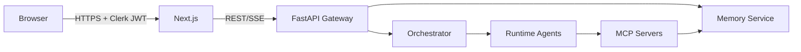

# Security threat model — A Step Forward

Last updated: 2026-06-23. Owner: Security stream (sub-agent 10).

## Scope

This document covers the **A Step Forward** learning platform: Next.js frontend, FastAPI gateway, memory/graphrag/orchestrator services, runtime AI agents, and MCP tool servers.

## Assets

| Asset | Sensitivity | Storage |
| ----- | ----------- | ------- |
| Learner memory (episodic, semantic, …) | High — may contain learning history | Postgres + pgvector |
| Auth tokens (Clerk JWT) | High | Client only; verified at API |
| Audit logs | Medium — operational, no raw PII | Postgres / in-memory buffer |
| Agent prompts | Medium — IP, jailbreak surface | Repo `prompts/` |
| KG / curriculum content | Low–medium | Neo4j, Postgres |

## Trust boundaries

- **Untrusted**: browser, learner input, third-party LLM providers (treated as untrusted output).
- **Semi-trusted**: Clerk (identity), educators/admins with RBAC.
- **Trusted**: internal services behind auth; still validate all inputs.

## Threat actors

1. **Anonymous / learner** — prompt injection, data exfiltration, cross-tenant access attempts.
2. **Compromised learner account** — scrape another learner's data via IDOR.
3. **Malicious educator/admin** — excessive data access, audit tampering (mitigated: append-only audit).
4. **External attacker** — JWT forgery, SSRF via agents, dependency supply chain.
5. **Child (COPPA)** — inadvertent PII overshare; exposure to inappropriate content.

## STRIDE summary

| Threat | Mitigation |
| ------ | ---------- |
| **Spoofing** | Clerk JWT + JWKS cache; iss/aud validation; no client-trusted roles |
| **Tampering** | TLS; memory writes via MemoryService only; provenance on every write |
| **Repudiation** | `audit_memory_events`, `audit_gateway_events`; RBAC denial logging |
| **Information disclosure** | PII redaction (Presidio + rules); per-row learner_id policy; encryption at rest (planned KEK) |
| **Denial of service** | Rate limits on API routes; agent token/latency budgets |
| **Elevation of privilege** | RBAC dependency factory; admin routes require admin/educator |

## Agent / LLM-specific threats

| Attack | Control |
| ------ | ------- |
| Prompt injection / jailbreak | Regex fast-path + SafetyModerationAgent; refusal templates |
| Tool abuse | Allowlisted tools per agent manifest |
| Harmful output | Pre/post safety hooks on every agent turn |
| PII in model context | Redaction before memory persistence; moderation `pii_overshare` category |
| Child-inappropriate content | Child mode: stricter patterns, no affective storage, tighter CSP connect-src |

## Child mode (COPPA-aware)

- Auto-enabled when `age < 13` or `child_mode = true`.
- No affective memory writes.
- Stricter input/output moderation thresholds.
- Frontend CSP excludes third-party analytics endpoints in child mode.

## Residual risks

| Risk | Status | Follow-up |
| ---- | ------ | --------- |
| Per-learner encryption (AES-GCM KEK) | Not implemented | Infra + memory stream |
| Presidio model download in CI/prod | Optional dep | Pin models in Docker image |
| Parent–child linkage table | Stub | Backend API stream 02 |
| Online jailbreak evals | Offline only | Evals stream 08 |
| WAF / DDoS edge | Not in scope | Vercel/Fly edge |

## Review cadence

- Review on any change to auth, memory policy, agent tool allowlists, or child mode.
- Record material decisions as ADRs under `docs/adr/`.
