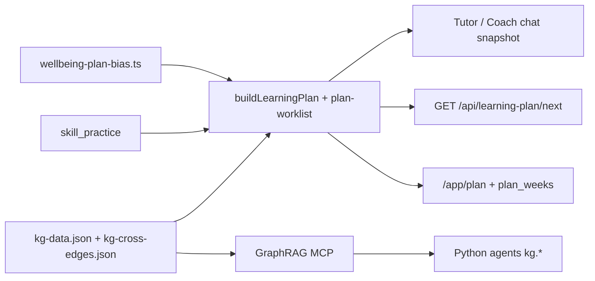

# Learning Path & GraphRAG Architecture

> **Read this** before changing KG edges, plan generation, mastery signals, Tutor suggestions, or the Memory tab.
> Repo skills: `.cursor/skills/use-learning-plan/SKILL.md`, `.cursor/skills/cross-subject-kg/SKILL.md`.

## Purpose

Learners get **knowledgeable suggestions** — not random weak topics — by walking a **combined knowledge graph** backward from a goal, weighted by:

1. **Reliance** — hard prerequisites (`prereq`, within-subject `prerequisites[]`)
2. **Connectivity** — cross-subject enablers (`applies_to`, `generalizes`, `models`, `tooling_for`)
3. **Mastery** — per-atom `skill_practice` (0–1); skip what is already ≥80%
4. **Time to goal** — exam in 1 week → shallow path; long horizon → full foundation chain *(partially implemented — see gaps)*

Target behavior: a **golden path** per goal, adjusted only when practice/diagnostic signals show stronger or weaker understanding.

---

## Two graph layers

### Layer 1 — Within-subject (`kg-data.json`)

| Item | Location |
|------|----------|
| Source of truth | `content/knowledge-graph/*.yaml` |
| Build | `pnpm vault:build-kg` → `apps/web/src/lib/kg-data.json` |
| Vault mirror | `obsidian-vault/concepts/*.md` (prerequisites wikilinked) |

Each concept has `prerequisites[]` — **same subject only** by convention.

### Layer 2 — Cross-subject (`kg-cross-edges.json`)

| Item | Location |
|------|----------|
| Source of truth | `apps/web/src/lib/kg-cross-edges.json` (hand-curated) |
| Runtime DB | Neon `kg_edges` (seeded with lessons workflow) |
| Count | ~93 edges (2026-07-03) |

Edge shape:

```json
{
  "src": "functions_quadratic",
  "dst": "kinematics_1d",
  "relation": "applies_to",
  "weight": 0.9,
  "note": "x(t) = x0 + v0 t + ½ a t² is a parabola."
}
```

| `relation` | Meaning | Example |
|------------|---------|---------|
| `prereq` | Cannot do `dst` without `src` | `vectors_basics → kinematics_2d` |
| `applies_to` | `src` is a tool inside `dst` | `trig_identities → ac_circuits` |
| `generalizes` | Abstract form of concrete topic | `derivatives_intro → kinematics_1d` |
| `models` | `dst` modeled mathematically by `src` | `differential_equations → simple_harmonic_motion` |
| `tooling_for` | Computational support | `la_matrices → kinematics_2d` |

**Physics learner stuck on kinematics** is often stuck on `functions_quadratic` or `trigonometry_ratios` — cross-edges capture that; within-subject prereqs alone do not.

---

## Skill atoms (finer than concepts)

| Table | Role |
|-------|------|
| `skill_atoms` | Canonical micro-skills (`product_rule_apply`, `free_body_diagram_force_sum`) |
| `lesson_skill_atoms` | Which lesson `teaches` / `exercises` each atom |
| `skill_practice` | Per-learner attempts/successes |

Author atoms in lesson JSON → `agent_hints.skill_atoms_unlocked[]` + per-question `skill_atoms[]` → re-seed.

The path planner scores **urgency** = 1 − mean mastery of atoms a concept teaches. **`blocking_atoms[]`** = root-cause diagnosis (atom × downstream concepts × (1 − mastery)).

---

## Three runtime consumers (must stay aligned)



### A. `buildLearningPlan()` — **authoritative for suggestions**

- File: `apps/web/src/lib/learning-plan.ts`
- BFS **backward** from goal; merges within-subject prereqs + cross-edges
- Drops nodes with ≥80% atom mastery (if practiced)
- Sorts by urgency; returns `path[]` + `blocking_atoms[]`
- Used: chat `## Learning-plan snapshot`, `GET /api/learning-plan/next`

### B. `generateLearningPlan()` — **persistence + calendar layer** *(unified, 2026-07-11)*

- File: `apps/web/src/lib/neon-db.ts` → `plan-worklist.ts` (`buildUnifiedPlanConceptOrder`)
- Calls `buildLearningPlan()` for concept ordering, then chunks into `plan_weeks`
- `numWeeks` from `next_test_date` / `final_goal_date`
- `focusConceptsOnly` when template supplies exam concepts (cram mode)
- **Wellbeing overlay** applied before week write (see below)

### C. GraphRAG MCP (Python / optional Neo4j)

- `mcp-servers/graphrag/` — `kg.search`, `kg.prereqs`, `kg.explain_path`, `kg.hybrid`
- Vercel critical path uses bundled JSON + Neon directly (no MCP round-trip)

---

## Golden path (target design)

1. **Default:** canonical backward walk from goal concept(s) along combined graph
2. **Skip** concepts with mastery ≥ 0.8 (already practiced)
3. **Include distant basics** only when:
   - atom mastery < 0.4 on a blocking prereq, OR
   - diagnostic/quiz failure on that prereq
4. **Time horizon:**
   - ≤7 days → cap graph depth; drop low-weight `applies_to` edges
   - ≥8 weeks → full prereq chain including math foundations
5. **Recompute plan** only on: template plan update, significant mastery shift, quiz failure on prereq

### Example — physics mechanics, exam in 1 week

Goal scope: `kinematics_1d`, `newton_laws`, `circular_motion`

```
Week 1: kinematics_1d → newton_laws → circular_motion
Math ONLY if blocking: functions_quadratic, trigonometry_ratios, vectors_basics
Exclude: unrelated math lesson mastery (sequences_5pt, integrals_4pt)
```

---

## Concept scoping (2026-07-03)

File: `apps/web/src/lib/concept-scope.ts`

| Function | Role |
|----------|------|
| `resolveConceptSubject()` | KG id **or** lesson-index id → subject |
| `conceptMatchesSubjects()` | Filter by learner profile subjects; unknown ids → **out** |
| `conceptInPlanScope()` | Mastery row belongs to active plan week concepts |
| `masterySignalInScope()` | Plan exists → plan concepts only; else subject filter |

Used in: Memory tab (`getLearnerMemorySnapshot`), chat `## Mastery so far`.

**Why:** lesson mastery keys like `sequences_5pt` are math lesson ids not in KG — old filter treated unknown as in-scope.

---

## Plan changes (template-only)

- Sidebar template: **עדכון תוכנית לימוד** / **Learning plan update** (Tutor chat only)
- Apply: message must be **template alone** — `isPlanChangeTemplate()` in `plan-change-template.ts`
- Agents: universal rule in `agent-baseline.ts`; casual requests → redirect to sidebar (no exam-scope Q&A substitute)
- Server ✅ notice = only source of truth for “plan updated”

See [[../product/plan-and-memory|Plan & memory (product)]].

---

## Wellbeing module (ADR-0008, shipped 2026-07-11)

File: `apps/web/src/lib/wellbeing-plan-bias.ts`

| Responsibility | Detail |
| --- | --- |
| Signal ingestion | Profile `mental_state.anxiety`, exam dates, mastery deltas, chat `exam_anxiety` intent |
| Internal state | `wellbeing_plan_bias` JSON on learner profile |
| Morale selection | `selectMoraleConcepts()` — strength-anchored 1-hop neighbors on combined graph |
| Persisted overlay | ~60% goal-critical / ~40% morale-adjacent when bias active |
| Cooldown gates | 72h min between wellbeing-class rewrites; mastery-shock exempt from weekly cap |
| Chat behavior | Anxiety intent injects learning-plan snapshot (`injectLearningPlanSnapshot: true`) |
| Dashboard UX | Neutral notice via `plan-adjustment-notice` — no mechanism reveal |

**Authority split:** learner-initiated goal/hours/exam changes remain **template-only** (Tutor sidebar). Server-driven wellbeing and mastery-shock adaptations do not require learner initiation.

Repo ADR: `docs/adr/0008-adaptive-wellbeing-planning.md`

---

## Known gaps (2026-07-11)

- ~~[ ] Unify `generateLearningPlan` with `buildLearningPlan` (single golden-path engine)~~ **Done (PR1)**
- [ ] Pass `targetDate` into path planner for depth trimming (partial)
- [ ] Curated default path sequences per `goal_key` (onboarding tracks)
- ~~[ ] Cross-subject edges in weekly plan worklist expansion~~ **Done via unified engine (PR1)**
- [ ] Content gaps — `hasLesson: false` on golden-path concepts (Bagrut 372/471/572)
- [ ] GraphRAG Neo4j `next_topics` mastery filter wired on web path
- [ ] Integration tests — `plan-neon.integration.test.ts`, wellbeing cooldown matrix

---

## Related

- [[kg-workflow|KG → vault workflow]]
- [[cross-subject-edges|Cross-subject edge authoring]]
- [[../product/plan-and-memory|Plan & memory product surface]]
- [[../coordination/streams/01-frontend|Frontend stream]]
- Repo: `ARCHITECTURE.md`, `AGENTS.md`
