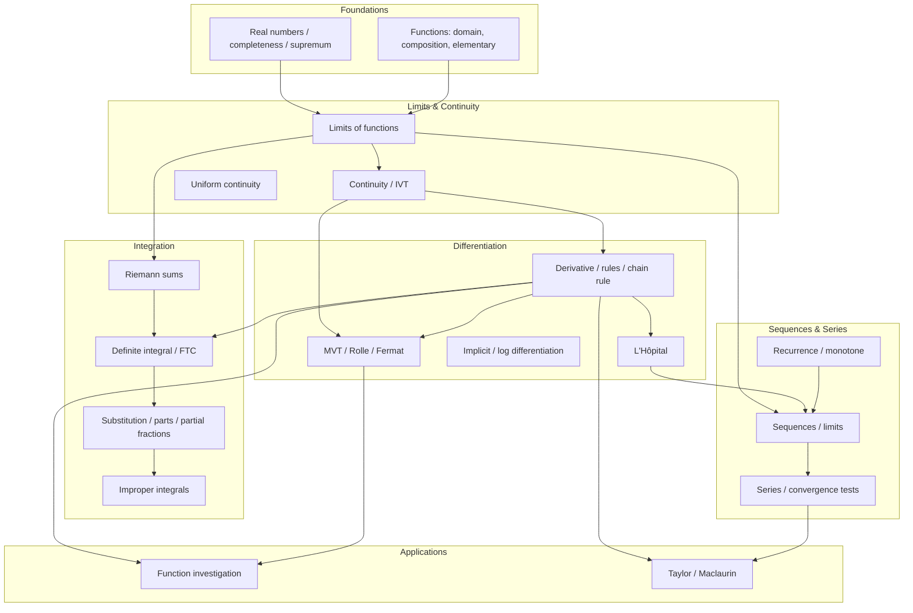
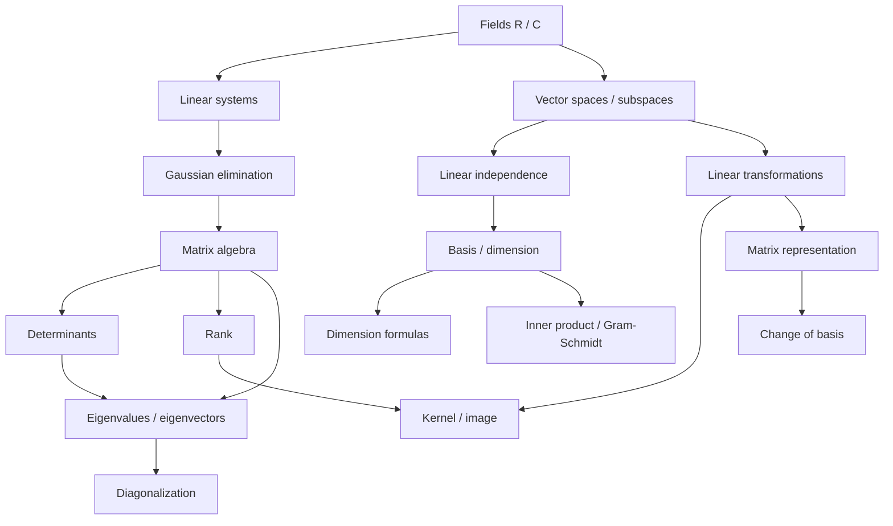
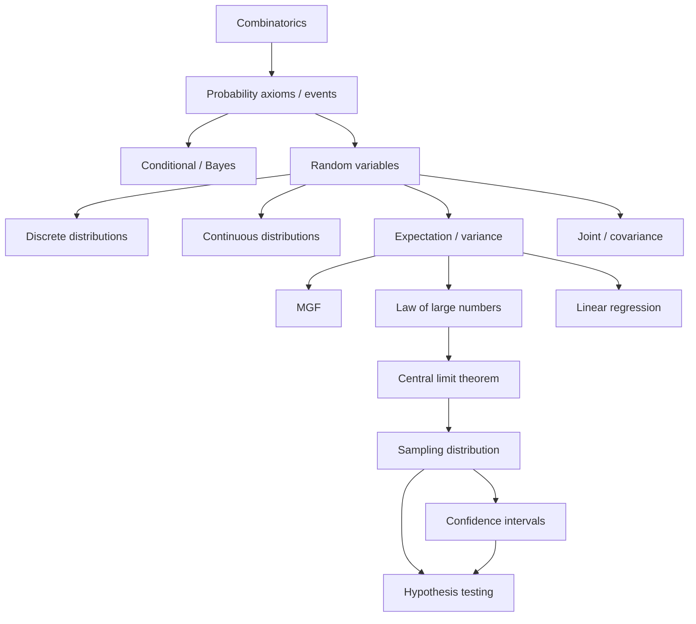

# Israeli University Mathematics Exam Research Report

**Purpose:** Calibrate lesson depth, dependency trees, mock exams, and rigor expectations for university-level Calculus 1 (חדו"א 1 / אינפי 1), Linear Algebra 1 (אלגברה לינארית 1), and Probability & Statistics (הסתברות וסטטיסטיקה).

**Scope:** TAU, Technion, Ariel, Bar-Ilan, Ben-Gurion, Hebrew University — primarily 2015–2024, with older archived exams where useful.

**Sources:** Official syllabi (shnaton.huji.ac.il, my.technion, tau yedion), past exam PDFs (math-wiki.com, faculty pages, u.cs.biu.ac.il/~tsaban), course lecture notes (BIU 88165), exam policy documents (Bar-Ilan, BGU, HUJ).

**Methodology note:** Topic frequency percentages are **estimates** based on sampling ~40+ past exams and syllabi across institutions, not a machine-count of every exam item. Percentages indicate "appears on roughly X% of sampled finals/moeds."

---

## Executive Summary

Israeli first-year university math divides into two cultural tracks:

| Track | Hebrew name | Typical audience | Exam character |
|-------|-------------|------------------|----------------|
| **Infinitesimal calculus** | אינפי 1 | Math, CS (exact sciences), physics | Proof-heavy; sequences/series; uniform continuity; often "choose N of M" |
| **Differential & integral calculus** | חדו"א 1 | Engineering, life sciences, some CS | Mixed proof + computation; fixed 6-question templates common at Ariel/BGU |
| **Linear algebra (math)** | אלגebra לינארית 1א | Exact sciences at TAU | Abstract vector spaces, dual spaces, Gram–Schmidt; minimal eigenvalues |
| **Linear algebra (engineering)** | אלגברה 1מ / 104019 | Technion, BGU, BIU engineering | Matrices + vector spaces + eigenvalues/diagonalization |
| **Intro probability & statistics** | מבוא להסתברות וסטטיסטיקה | All STEM | ~80% computation/application; proofs limited to probability identities |

**Cross-institution constants:** 3-hour finals (2.5h at some BIU Infi moeds); simple calculator only (or none for TAU math LA); no formula sheet at most institutions; partial credit for method; written justification required.

---

## 0. Institutional Naming & Course Codes

| Institution | Calculus 1 | Linear Algebra 1 | Probability & Statistics |
|-------------|-----------|------------------|--------------------------|
| **TAU** | 0366-1101 (Calculus 1a), 0509-1746 (Calc 1B eng.) | 0366-1111 (LA 1a math) | Faculty-specific; eng. uses dedicated stats courses |
| **Technion** | 104003 (חדו"א 1), 104018 (חדו"א 1מ — more theory) | 104019 (אלגברה 1מ) | 94481 (מבוא להסתברות וסטטיסטיקה) |
| **Ariel** | 38-111 (חדו"א 1 להנדסה) | 88112 (אלגברה לינארית 1) | — |
| **Bar-Ilan** | 07-05-132-88 / 98-131 (אינפי 1), 38-111 (eng. hedva) | Various (CS/math/engineering) | 88-165 (מבוא להסתברות וסטטיסטיקה) |
| **BGU** | Diff. & Int. Calc. ME1 (engineering) | 212.9511 (electrical eng.) | Via math dept. courses |
| **Hebrew U** | 71007 (חדו"א I), 80177 (eng./science) | 80153 (LA for eng./science) | 80430, 54111, 80312 |

---

## 1. Calculus 1 (חדו"א 1 / אינפי 1)

### 1.1 Two Tracks — Critical Distinction

**אינפי 1 (Infi):** Axiomatic real numbers, ε-δ limits, uniform continuity, series convergence proofs, Cesaro means. Bar-Ilan's flagship course; TAU Calculus 1a for math majors is similarly theoretical (Cauchy sequences, power series convergence interval).

**חדו"א 1 (Hedva):** Operational calculus for engineers — limits by techniques, L'Hôpital, integration methods, function investigation, improper integrals, sequences (often recurrence + monotone convergence), sometimes series. Technion 104003/104018, BGU engineering, Ariel 38-111.

> **Platform implication:** Offer two difficulty profiles or tag lessons as `infi-rigor` vs `hedva-applied`.

### 1.2 Exam Structure by Institution

| Institution / course | Duration | Questions | Format | Points | Calculator | Formula sheet |
|---------------------|----------|-----------|--------|--------|------------|---------------|
| **Ariel 38-111** (2017–2019 samples) | 3 h | 6 | Answer **all** | 10 each (100) | Simple only | No |
| **Bar-Ilan Infi** (2025 moed B) | ~2.5 h | Part 1: ~10 T/F; Part 2: **2 of 3** | Two-part | 30 + 66 (+4 neatness) | Per policy | No |
| **Bar-Ilan Infi** (2016 moed A) | 2.5 h | **4 of 5** | Essay proofs | 24 each (+4 neatness) | Simple only | No |
| **Bar-Ilan CS Infi 98-131** (2020) | 3 h | 5 | Answer **all** | 11 each (110 max) | Simple only | No |
| **Technion 104003/104018** | 3 h | ~5–7 (varies by lecturer) | Usually all | Unequal weights | Simple only | No |
| **TAU Calculus 1a** | 3 h | 4–5 | Varies | Equal or by part | Usually none | No |
| **BGU engineering** | 3 h | ~5–6 | All or choose | 15–20 each | Simple only | No |

**Common patterns:**
- **"Choose N of M":** Bar-Ilan Infi (4/5 or 2/3), some HUJ/BIU discrete math; less common in engineering hedva.
- **Fixed template (engineering):** Ariel/BGU-style exams repeat structure: Q1 limits (3 sub), Q2 integral + improper convergence, Q3 MVT/IVT proof, Q4 recurrence sequence, Q5 limits of sums/Riemann, Q6 Taylor/error or graph investigation.
- **Technion grading mix:** Weekly quizzes + midterm + final (104018 documented).

### 1.3 Topic Frequency Matrix (Calculus 1)

Estimated from sampled exams 2015–2024:

| Topic | TAU (1a) | Technion (104003/18) | Ariel (38-111) | Bar-Ilan (Infi) | BGU (eng.) | HUJ (71007/80177) | Notes |
|-------|----------|---------------------|----------------|-----------------|------------|-------------------|-------|
| Limits (functions) | 95% | 100% | 100% | 90% | 100% | 95% | Always Q1-style; ε-δ proofs at Infi/TAU math |
| L'Hôpital / indeterminate forms | 70% | 95% | 90% | 60% | 95% | 85% | Core hedva; less central at pure Infi |
| Continuity / IVT | 85% | 90% | 80% | 95% | 85% | 90% | IVT for root-counting very common (eng.) |
| Uniform continuity | 80% | 30% | 20% | 90% | 15% | 50% | **Infi killer topic** |
| Derivatives / chain rule | 90% | 100% | 85% | 75% | 100% | 95% | Often embedded, not standalone |
| MVT / Rolle proofs | 75% | 60% | 85% | 80% | 70% | 75% | "Prove using MVT" archetype |
| Function investigation | 60% | 95% | 70% | 50% | 95% | 80% | Full analysis: domain, asymptotes, extrema |
| Definite/indefinite integrals | 85% | 100% | 100% | 70% | 100% | 95% | By parts, substitution, partial fractions |
| Improper integrals | 70% | 90% | **100%** | 65% | 90% | 80% | Almost always "converge or diverge?" sub-question |
| Sequences | 90% | 85% | **100%** | **95%** | 80% | 85% | Recurrence + monotonicity proofs (eng.) |
| Series (convergence tests) | **95%** | 80% | 40% | **95%** | 50% | 70% | Ratio, root, comparison, alternating — Infi staple |
| Riemann sums → integral | 50% | 40% | **85%** | 60% | 35% | 45% | Ariel Q6 archetype |
| Taylor / error bounds | 75% | 90% | 70% | 70% | 85% | 80% | Often paired with Riemann approximation |
| Squeeze theorem | 60% | 70% | 75% | 85% | 65% | 70% | |

### 1.4 Proof vs. Computation Ratio

| Track | Proof / justification | Pure computation |
|-------|----------------------|------------------|
| **Infi (BIU, TAU math)** | **60–80%** | 20–40% |
| **Engineering hedva (Ariel, BGU, Technion 104003)** | **30–50%** | 50–70% |
| **Technion 104018 (1מ — "more theory")** | **45–60%** | 40–55% |

Proof types seen:
- Full theorem proof (Weierstrass extremum, Cesaro mean)
- "Prove using MVT that…" (increasing → f'(x)≥0; at most one fixed point)
- ε-δ or sequential characterization
- Series convergence justification (not just ratio test arithmetic)
- Uniform continuity → boundedness

### 1.5 Recurring Question Archetypes

1. **The MVT proof** — "f continuous on [a,b], differentiable on (a,b); prove…" (unique solution to e^x = ax+b, at most one fixed point, existence of c with f'(c)=k).

2. **Convergence classification** — Alternating series, ratio vs. root, conditional vs. absolute (Infi/BIU 2016 moed A Q2; BIU CS 2020 Q3).

3. **Recurrence sequence** — a_{n+1} = f(a_n); prove monotone bounded → convergent; find limit (Ariel Q5 every year).

4. **Improper integral** — ∫_1^∞ (ln x)/x^p dx or similar; comparison/limit comparison (Ariel Q2ב every sample).

5. **Riemann sum limit** — lim (1/n)Σ f(k/n) → ∫_0^1 f(x)dx (Ariel Q6א).

6. **Root counting via analysis** — f(x)=e^x − ax + b; how many solutions for parameter a (Ariel Q3).

7. **Supremum / completeness** — sup(A∩B) ≤ min(sup A, sup B); bounded sets (BIU CS 2020 Q2).

8. **Uniform continuity** — define, prove f uniformly continuous on ℝ ⇒ f bounded; or f−g bounded (BIU 2016 Q4).

### 1.6 Sample Exam Structures (Verbatim Patterns)

**Ariel 38-111 (engineering, Dr. Erez Sheiner):**
```
Duration: 3 hours | Aid: simple calculator only
Weight: 10 points per question | Answer ALL questions
Typical 6 questions: limits (3) → integral + improper → IVT/MVT → sequence → Riemann/Taylor
```

**Bar-Ilan Infi 2025 moed B:**
```
Part 1 (30 pts): True/False, no justification — ALL questions; need ≥6 correct to pass threshold
Part 2 (66 pts): Written — choose 2 of 3 (33 pts each)
+4 pts for neatness
```

**Bar-Ilan Infi 2016 (math track):**
```
Duration: 2.5 hours | No aids except simple calculator
Choose 4 of 5 questions (24 pts each) + 4 neatness
ALL 5 questions were proof-theoretic (Weierstrass, series, Cesaro, uniform continuity, fixed point)
```

---

## 2. Linear Algebra 1 (אלגברה לינארית 1)

### 2.1 Syllabus Split — Math vs. Engineering

| Topic | TAU LA 1a (math) | Technion 104019 (1מ) | HUJ 80153 (eng.) | Ariel 88112 |
|-------|------------------|---------------------|-------------------|-------------|
| Gaussian elimination | ✓ | ✓ | ✓ | ✓ |
| Matrices, inverse, rank | ✓ | ✓ | ✓ | ✓ |
| Determinants | ✓ | ✓ | ✓ | ✓ |
| Vector spaces, subspaces | ✓ (abstract) | ✓ | ✓ | ✓ |
| Linear maps, ker/im | ✓ | ✓ | ✓ (if time) | ✓ |
| Matrix representation | ✓ | ✓ | ✓ | ✓ |
| Change of basis | ✓ | ✓ | ✓ | ✓ |
| Dual spaces | ✓ | — | — | — |
| Inner product, Gram–Schmidt | ✓ | — (LA 2) | partial | partial |
| Eigenvalues, diagonalization | **LA 1b** | ✓ | partial | ✓ |

### 2.2 Exam Structure by Institution

| Institution | Duration | Format | Calculator | Notes |
|-------------|----------|--------|------------|-------|
| **Ariel 88112** (2025) | 3 h | Answer **all** (~5 questions, 8 pts/sub) | Simple | Heavy "prove or disprove" |
| **TAU LA 1a** (2020) | 3 h | Answer **all** (4 questions, equal) | **None** | Pure proof |
| **Bar-Ilan** (2011 summer) | 2.5 h | Part A: 1 of 2 proofs; Part B: **3 of 4** | Simple | 105 max if both proof Qs attempted |
| **Bar-Ilan** (2010) | 3 h | Part 1: **2 of 3** detailed (25 ea.); Part 2: **5 of 6** T/F table (10 ea.) | — | Mixed |
| **Technion 104019** | 3 h | All questions typical | Simple | Eigenvalues standard |
| **HUJ** (76967 supplement) | 3 h | Archived moeds 2013–2024 on Moodle | Varies | Schaum-based |

### 2.3 Topic Frequency Matrix (Linear Algebra 1)

| Topic | TAU (1a) | Technion | Ariel | Bar-Ilan | BGU (eng.) | HUJ (80153) | Notes |
|-------|----------|----------|-------|----------|------------|-------------|-------|
| Linear systems (parameter a) | 85% | 90% | 90% | 85% | 95% | 95% | **#1 killer** — "for which a…" |
| Gaussian elimination | 80% | 85% | 75% | 80% | 90% | 95% | Often computational sub-part |
| Matrix inverse / rank | 75% | 85% | 80% | 75% | 85% | 90% | |
| Determinants | 70% | 80% | 70% | 75% | 80% | 85% | det(AB)=det A det B proofs |
| Subspaces, span, basis | **95%** | 90% | **95%** | 90% | 85% | 90% | |
| Linear independence | **95%** | 90% | **95%** | 90% | 85% | 90% | Prove/disprove staple |
| Dimension formula | 85% | 80% | 85% | 90% | 70% | 80% | dim(U+W), rank-nullity |
| Linear transformations | **90%** | 90% | **95%** | 85% | 80% | 75% | |
| Ker / Im, find basis | 85% | 85% | 90% | 80% | 75% | 70% | |
| Matrix of linear map | 80% | 85% | 85% | 75% | 70% | 65% | Change of basis |
| Prove or disprove (abstract) | **90%** | 70% | **95%** | **95%** | 50% | 60% | See §2.5 |
| Eigenvalues / diagonalization | 10% (1b) | **85%** | 80% | 70% | 75% | 40% | Technion/Ariel core |
| Inner product / Gram–Schmidt | 80% | 20% | 30% | 40% | 30% | 25% | TAU math emphasis |
| Direct sum ⊕ | 75% | 60% | 85% | 70% | 50% | 55% | C(A)⊕N(A) iff rank condition |
| Similarity of matrices | 40% | 75% | 70% | 55% | 60% | 30% | |

### 2.4 Proof vs. Computation Ratio

| Track | Proofs (incl. prove/disprove) | Computation |
|-------|------------------------------|-------------|
| **Math (TAU 1a, BIU pure)** | **50–70%** | 30–50% |
| **Engineering (Technion, Ariel, BGU)** | **25–45%** | 55–75% |
| **Mixed BIU formats** | **40–60%** | 40–60% |

TAU 2020 moed A: **100% proof** (4 questions, all "הוכיחו").
Ariel 2025 moed A: Q3–Q5 predominantly "הוכיחו או הפריכו."

### 2.5 Classic Recurring Question Types

1. **Parameter a in Ax=b** — unique solution / infinitely many / none; for which a is b in Col(A)?

2. **Prove or disprove (הוכח או הפרך)** — e.g.:
   - span(A)∩span(B)≠{0} ⇒ span(A)∪span(B) is a subspace (FALSE — counterexample)
   - W∪U is a subspace (FALSE)
   - If AB=I then BA=I (TRUE for square matrices)

3. **Find basis for ker(T) and im(T)** — often T: R³→R³ or P₂→P₂ given by differentiation-like rule.

4. **Is T diagonalizable? Diagonalize if yes** — Technion/Ariel; characteristic polynomial.

5. **Dimension inequality** — dim(W'∩W'') ≥ dim V − 2 dim W (TAU 2020 Q3).

6. **Matrix representation under change of basis** — [T]_B vs [T]_C.

7. **Direct sum decomposition** — Fⁿ = C(A) ⊕ N(A) iff rank(A)=n (Ariel 2025 Q4).

8. **Polynomial space maps** — T(p)=αp''+βp'+γp; find α,β,γ for ker T={0} (TAU 2020 Q1).

### 2.6 Writing Style Expectations (LA)

- Open with formal setup: "יהי V מרחב וקטורי מעל שדה F…"
- **Cite theorems explicitly** — Bar-Ilan 2011: "יש לצטט כל משפט שאתם משתמשים בו!!!"
- Disproof = **counterexample** ("הפרכה = דוגמה נגדית")
- T/F sections: no justification unless specified

---

## 3. Probability and Statistics (הסתברות וסטטיסטיקה)

### 3.1 Course Variants

| Code | Institution | Emphasis | Exam weight |
|------|-------------|----------|-------------|
| 88-165 | Bar-Ilan | Full intro; 153-page lecture notes | 80% final, 20% quizzes |
| 94481 | Technion | Probability + inferential stats | Final + components |
| 80430 | Hebrew U | Probability theory + Bayesian intro | **90%** final |
| 54111 | Hebrew U | Stats & probability (broader inference) | 70% final, 25% midterms |
| 80312 | Hebrew U | Rigorous probability (9 weeks) + stats (4 weeks) | Standard |
| 71025 | Hebrew U | Intro + JMP/Excel descriptive | 10% Excel test |

### 3.2 Exam Structure

- **Duration:** Typically 2.5–3 hours.
- **Format:** Answer all questions (most samples); 4–6 main questions with sub-parts.
- **Calculator:** Simple calculator or none; statistical tables sometimes provided (z-table, t-table) — check specific course.
- **Formula sheet:** Rarely provided; students expected to know distributions, E/Var formulas, CI templates.
- **Language:** Hebrew question statements; mathematical notation universal.

### 3.3 Topic Frequency

| Topic | Frequency | Depth on exams |
|-------|-----------|----------------|
| Combinatorics (permutations, combinations) | 90% | Medium — often standalone Q1 |
| Sample space, events, axioms | 85% | Light–medium |
| Conditional probability, Bayes | **95%** | **Deep** — multi-step trees |
| Discrete RVs: Binomial, Poisson, Geometric, Hypergeometric | **95%** | Deep — identify distribution, compute P |
| Continuous: Uniform, Exponential, Normal | **95%** | Deep — density, CDF, transformation |
| Expectation, variance, covariance | 90% | Medium–deep |
| MGF / moment generating functions | 40% | Surface at intro; deep at 80312/52006 |
| LLN | 60% | Conceptual + application |
| CLT | **90%** | **Deep** — approximate P(X̄>…) with continuity correction |
| Confidence intervals | **85%** | Deep — one/two sample, z vs t |
| Hypothesis testing, p-values | **90%** | Deep — rejection regions, Type I/II |
| Linear regression (simple) | 70% | Medium — least squares, R², inference on slope |
| Descriptive statistics | 50% | Light at university level (more in 71025) |

### 3.4 Proof vs. Computation

| Type | Share of exam |
|------|---------------|
| **Computation** (calculate P, E, Var, CI, test statistic) | **70–85%** |
| **Short proof/justification** (show independence, derive E(X), Markov) | **10–20%** |
| **Conceptual** (explain interpretation of CI, p-value) | **5–15%** |

HUJ 80430 learning outcomes explicitly include "prove the weak law of large numbers" — but on a typical engineering intro exam, proofs are limited to 1–2 sub-questions.

### 3.5 Recurring Archetypes

1. **Bayes with partition** — disease testing, urns, manufacturing defects.
2. **Identify distribution** — "X = number of … until first success" → Geometric.
3. **Normal approximation** — Binomial(n,p) with np(1−p)>5; continuity correction.
4. **CLT for sample mean** — n=36, σ known, P(X̄>μ₀+1.5).
5. **CI for μ** — z-interval vs t-interval decision.
6. **Hypothesis test** — H₀: μ=μ₀ vs H₁: μ≠μ₀; compute test statistic, compare to critical value or p-value.
7. **Joint RV** — marginal, conditional, E(XY) via covariance.
8. **MGF uniqueness** — show X has same MGF as known distribution (advanced courses).

---

## 4. Dependency Trees

### 4.1 Calculus 1 — Internal Dependencies



**Critical paths for exams:**
- `R → L → C → MVT` (proof track)
- `L → D → FI` (engineering track)
- `DEF → TECH → IMP` (integration block — always tested)
- `SEQ → REC` (Ariel Q5 template)
- `RI → DEF` (Riemann sum questions)

### 4.2 Linear Algebra 1 — Internal Dependencies



**Critical paths:**
- `SYS → GAUSS → RANK` (computational backbone)
- `VS → LI → BASIS → DIMF` (proof backbone)
- `LT → KER → MATREP` (transformation questions)
- `EIG → DIAG` (engineering finals)

### 4.3 Probability & Statistics — Internal Dependencies



### 4.4 Cross-Course Dependencies

| From → To | What carries over |
|-----------|-------------------|
| **Calculus → Linear Algebra** | Minimal formal prereq; comfort with Rⁿ notation, polynomials, limits (for matrix exponentials in LA2). Engineering programs run them **in parallel** semester 1. |
| **Calculus → Statistics** | Integration for PDF normalization, E(X)=∫x f(x)dx; Taylor for approximations. Calculus 1 usually sufficient. |
| **Combinatorics (discrete math) → Statistics** | Counting for probability; BIU engineering takes combinatorics (83108) alongside calc/LA. |
| **Linear Algebra → Statistics** | Regression = least squares in Rⁿ; covariance matrices (second course). LA1 gives matrix notation for regression. |
| **Probability → Statistics** | **Hard gate:** CLT, sampling distributions, CI, and HT all assume RV/distribution fluency. Stats half of course is unreachable without probability half. |

**Recommended platform sequencing:**
1. Calculus 1 + Linear Algebra 1 (parallel, semester 1)
2. Probability foundations (semester 2 or parallel with Calc 2)
3. Inferential statistics (after CLT module mastered)

---

## 5. Exam Format Patterns (Cross-Course)

### 5.1 "Choose X of the Following"

| Pattern | Where seen | Typical X/M |
|---------|-----------|-------------|
| Choose essay questions | Bar-Ilan Infi, LA, discrete math | 4/5, 2/3, 3/4 |
| Choose + mandatory | BIU Infi 2025: all T/F + 2/3 essays | Mixed |
| Choose T/F subset | BIU LA 2010 | 5/6 |
| Answer all | Ariel hedva/LA, most Technion finals | — |
| Bagrut (high school, not university) | 5/8 or 4/8 | Reference only |

**Rules when choosing:**
- Circle selected questions on cover table (BIU).
- Excess answers graded as **first N in booklet order** (Bagrut rule; sometimes university).
- Attempting extra proof questions may cap at 105/100 (BIU LA 2011).

### 5.2 Grading: Process vs. Answer

**University norm (BGU regulations, HUJ bylaws, BIU policy):**
- **Partial credit standard** — markers note mistakes and allocate points per component.
- **Method matters** — "justify or explain if answer incomplete" (HUJ 7.7).
- **Final answer alone insufficient** for full marks on proof/computation questions.
- **No Bagrut-style answer-only** — unlike Israeli matriculation, university exams expect written reasoning.
- **Appeals** — students may review notebooks; regrading can raise or lower score.

**Practical grading rubric (typical TA/instructor):**
| Component | Weight |
|-----------|--------|
| Correct setup / definitions | 15–25% |
| Valid method / theorem choice | 30–40% |
| Execution / algebra | 25–35% |
| Final answer + conclusion | 10–20% |

**Neatness bonus:** +4 points explicit at BIU (Infi 2016, 2025).

### 5.3 First-Year Engineering Mathematics Structure

Standard **semester 1** (Technion, TAU EE, BIU EE, BGU):

| Course | Credits | Hours (lec+rec) |
|--------|---------|-----------------|
| Calculus 1 (חדו"א 1) | 5–6 | 4+2 typical |
| Linear Algebra 1 | 5–6 | 4+2 typical |
| Physics 1 | 2.5–6 | varies |
| Intro programming | 2–4 | — |

**Semester 2:** Calculus 2, Probability & Statistics (or dedicated probability then stats), Physics 2, ODEs.

Technion spring-admission engineering cluster (2024): 1040018 (חדו"א 1מ) + 1040016 (אלגברה 1מ) in one semester.

---

## 6. Calibration Guidance for Platform

### 6.1 Calculus 1 — Score Benchmarks

| Score | Typical ability | Typical gaps |
|-------|-----------------|--------------|
| **60 (pass)** | Compute standard limits and derivatives; basic integration by substitution; recognize IVT applications | Struggles with series proofs; improper integral comparison; cannot prove MVT applications |
| **75** | Solid on all hedva templates; can classify series with ratio/root; solve recurrence limits | Uniform continuity proofs shaky; ε-δ incomplete; Riemann sum setup errors |
| **90** | Clean proofs (MVT, monotone sequence); correct series conditional/absolute; fluent improper integrals | May miss edge cases in counterexamples; Taylor error bounds with Lagrange remainder |
| **95+** | Publication-quality proof writing; handles trick series and nested limits | — |

**Exam killers (Calculus):**
1. Series convergence with alternating + conditional (Infi)
2. Uniform continuity proofs on unbounded domains
3. Recurrence: prove monotonicity **and** bound **before** taking limit
4. Improper integral — choosing wrong comparison function
5. ε-δ limits (Infi track)

**Surface vs. deep:**

| Surface | Deep |
|---------|------|
| L'Hôpital drill | Prove validity conditions / indeterminate form classification |
| Compute derivative | Prove using MVT that f'=0 ⇒ constant |
| Evaluate integral | Improper convergence proof via comparison |
| Find sequence limit | Prove convergence via monotonicity + boundedness first |

**Writing style:**
- **Engineering:** "נחשב את הגבול…" → explicit steps → boxed answer.
- **Infi:** "תהי f רציפה ב-[a,b]…" → cite theorem → chain of implications → "לכן…"
- Always **נמקו** (justify) when stated in header.

### 6.2 Linear Algebra 1 — Score Benchmarks

| Score | Typical ability | Typical gaps |
|-------|-----------------|--------------|
| **60** | Row-reduce systems; compute det; basic ker/im for concrete maps | Cannot prove abstract claims; dimension formula errors |
| **75** | Parameter-a systems; find bases; matrix of T; some prove/disprove | Change of basis errors; diagonalization when defective |
| **90** | Fluent prove/disprove with counterexamples; direct sums; similarity | Jordan form (if not in syllabus); subtle independence over F vs R |
| **95+** | Elegant dimension arguments; dual space (TAU) | — |

**Exam killers (LA):**
1. Parameter-dependent systems (consistency conditions)
2. Prove/disprove span/independence claims
3. Find basis for ker(T) when T is abstract (polynomial map)
4. Diagonalization — defective matrices, algebraic vs geometric multiplicity
5. Direct sum conditions (C(A)⊕N(A))

**Surface vs. deep:**

| Surface | Deep |
|---------|------|
| Row reduce to RREF | Parameter analysis for infinite solutions |
| Compute eigenvalues | Diagonalize and justify via ker(T−λI) |
| "Is this a subspace?" check 3 axioms | Prove/disprove for general W,U |

### 6.3 Probability & Statistics — Score Benchmarks

| Score | Typical ability | Typical gaps |
|-------|-----------------|--------------|
| **60** | Basic counting; single RV E/Var; z-score lookup | Bayes multi-step; CI vs HT confusion |
| **75** | Bayes; standard distributions; CLT approximation; one-sample CI | Two-sample tests; regression inference |
| **90** | Joint RV; correct test selection; interpret p-value/CI | MGF proofs; subtle independence |
| **95+** | Handles mixed discrete/continuous; full regression diagnostics | — |

**Exam killers (Stats):**
1. Bayes with false positive / base rate neglect
2. CLT — forgetting continuity correction or wrong σ/√n
3. CI — z vs t decision; wrong degrees of freedom
4. Identifying wrong distribution model
5. Hypothesis test — one-tailed vs two-tailed critical region

**Surface vs. deep:**

| Surface | Deep |
|---------|------|
| Plug into CI formula | Interpret "95% confidence" correctly |
| Compute P(X>k) for Binomial | Recognize when Poisson/normal approx applies |
| State H₀/H₁ | Compute power / Type II error (advanced) |

---

## 7. Mock Exam Templates (Recommended)

### 7.1 Engineering Calculus 1 (Ariel/BGU style) — 3 hours, 100 pts

| Q | Topic | Pts | Archetype |
|---|-------|-----|-----------|
| 1 | 3 limits (0/0, ∞/∞, sequence) | 15 | Computation |
| 2 | Definite integral + improper convergence | 15 | Mixed |
| 3 | IVT/MVT proof (root count or monotonicity) | 15 | Proof |
| 4 | Recurrence sequence: prove convergent, find limit | 15 | Proof + computation |
| 5 | lim (1/n)Σf(k/n) or Taylor remainder | 20 | Riemann/Taylor |
| 6 | Function investigation OR ε-δ (if Infi variant) | 20 | Mixed |

**Allowed:** Simple calculator. **Answer all.**

### 7.2 Infi Calculus 1 (Bar-Ilan style) — 2.5 hours, 100 pts

**Option A — Choose 4/5 (24 pts each + 4 neatness):**
- 2 pure proofs (theorem or ε-δ)
- 1 series convergence (3 series)
- 1 sequence / Cesaro
- 1 continuity / uniform continuity

**Option B — Two-part (2025):**
- Part 1: 10 T/F (3 pts each)
- Part 2: Choose 2/3 essay (33 pts each)

### 7.3 Linear Algebra 1 (Ariel/Technion style) — 3 hours

| Q | Topic | Pts |
|---|-------|-----|
| 1 | Parameter system / rank conditions | 16 |
| 2 | Linear map: ker, im, matrix representation | 16 |
| 3 | Prove or disprove (3 claims) | 24 |
| 4 | Direct sum / dimension | 16 |
| 5 | Eigenvalues / diagonalization OR Gram–Schmidt (track-dependent) | 16 |
| 6 | Determinant / invertibility | 12 |

### 7.4 Probability & Statistics — 3 hours

| Q | Topic | Pts |
|---|-------|-----|
| 1 | Combinatorics | 15 |
| 2 | Conditional / Bayes | 20 |
| 3 | RV: E, Var, distribution identification | 20 |
| 4 | CLT or normal approximation | 15 |
| 5 | Confidence interval | 15 |
| 6 | Hypothesis test | 15 |

---

## 8. Primary Source Index

### Calculus
- [HUJ 71007 syllabus](https://shnaton.huji.ac.il/index.php/NewSyl/71007/1/)
- [TAU Calculus 1a syllabus](https://www30.tau.ac.il/yedion/syllabus.asp?course=03661101&group=view&year=2019)
- [Technion 104003 / 104018](https://students.technion.ac.il/local/technionsearch/course/104003)
- [Ariel 38-111 exams](https://math-wiki.com/index.php/%D7%97%D7%93%D7%95%D7%90_1_-_%D7%90%D7%A8%D7%96_%D7%A9%D7%99%D7%99%D7%A0%D7%A8)
- [BIU Infi 2016 moed A](https://math-wiki.com/images/e/e8/Calc1_2016a_exam.pdf)
- [BIU Infi 2025 moed B](https://math-wiki.com/images/4/4c/Infi-1_2025moedB.pdf)
- [BIU CS Infi 2020](https://math-wiki.com/images/8/8c/19CSInfi1A.pdf)
- [TAU past exams archive](https://u.cs.biu.ac.il/~tsaban/Infi/InfiExams.html)

### Linear Algebra
- [TAU LA 1a syllabus](https://www30.tau.ac.il/yedion/syllabus.asp?course=03661111&group=view&year=2019)
- [Technion 104019](https://students.technion.ac.il/local/technionsearch/course/104019/202302?lang=en)
- [Ariel 88112 exam 2025](https://www.math-wiki.com/images/a/ad/25Linear1SummerTestA.pdf)
- [TAU LA 2020 moed A](http://www.math.tau.ac.il/~ginzburg/linear_algebra_1_a_2020.pdf)
- [BIU LA exams index](https://u.cs.biu.ac.il/~tsaban/LinearAlgebra/linear.html)

### Probability & Statistics
- [BIU 88165 course page + exams](https://u.math.biu.ac.il/~vishneu/courses/88165/88165.html)
- [Technion 94481](https://students.technion.ac.il/local/technionsearch/course/94481)
- [HUJ 80430 syllabus](https://shnaton.huji.ac.il/index.php/NewSyl/80430/1/2024/)
- [HUJ 54111 syllabus](https://shnaton.huji.ac.il/index.php/NewSyl/54111/1/2025/)
- [HUJ 80312 probability syllabus PDF](https://shnaton.huji.ac.il/index.php/NewSyl/80312/1/2023/pdf/)

### Exam policy
- [Bar-Ilan Exam Policy Handbook v11](https://biuinternational.com/wp-content/uploads/2024/02/%D7%A0%D7%95%D7%94%D7%9C-%D7%91%D7%97%D7%99%D7%A0%D7%95%D7%AA-%D7%9E%D7%94%D7%93%D7%95%D7%A8%D7%94-11-%D7%AA%D7%A9%D7%A4%D7%92-2023_E.pdf)
- [BGU exam regulations](https://www.bgu.ac.il/media/b0edbn20/exam-regulations.pdf)
- [HUJ academic bylaws (marking)](https://studentsadmin.huji.ac.il/sites/default/files/minhalt/files/takanon2023english.pdf)

---

## 9. Platform Implementation Checklist

- [ ] Tag every lesson `track: infi | hedva | both`
- [ ] Tag proof level: `proof: none | guided | full`
- [ ] Build mock exam generator with institution presets (Ariel 6Q, BIU choose-N, TAU all-proof LA)
- [ ] Dependency graph in KG: enforce `series` after `sequences`; `CLT` after `normal-distribution`
- [ ] Exam-killer drill mode for: series convergence, Bayes, parameter-a systems, recurrence sequences
- [ ] Rubric-aware grading prompts: partial credit for method even if final answer wrong
- [ ] Hebrew exam phrasing templates: "הוכיחו", "קבעו", "חשבו", "הוכיחו או הפריכו", "נמקו"

---

*Report generated: June 2025. For curriculum calibration in A Step Forward platform.*
