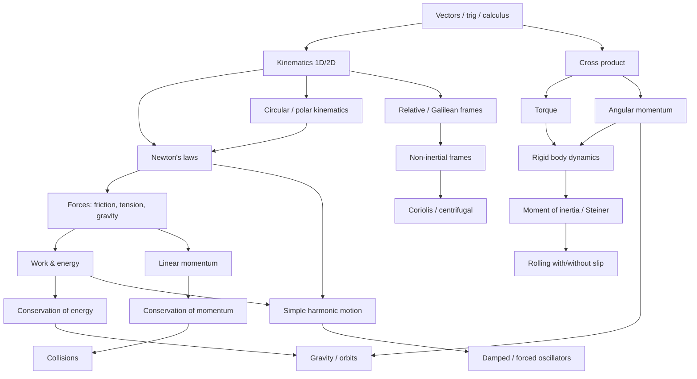
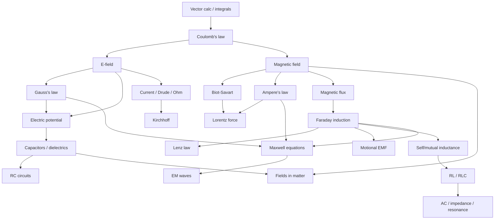

# Israeli University Physics 1 & 2 — Exam Research Report

**Purpose:** Calibrate lesson depth, build topic dependency trees, design mock exams, and map the Bagrut → university gap.  
**Scope:** Physics 1 (מכניקה / Mechanics) and Physics 2 (פיזיקה 2 / חשמל ומגנטיות / Electromagnetism), 2015–2024, multi-institution.  
**Research date:** June 2026  
**Sources:** Official syllabi (TAU, Technion, HUJI, BGU, Ariel), archived exams (Math-Wiki TAU 2010–2011), Technion classification portal, Bagrut exam booklets (Ministry of Education 2023), Neaman Institute curriculum analysis, prep-course materials (GOOL, UniVeli, MarathonX), Weizmann diversity report.

---

## Executive Summary

Israeli **Physics 1** at major universities converges on a shared Newtonian mechanics core—vectors through gravity/SHM—with divergence at the **engineering vs. physics-major** track: physics majors (BGU, TAU Exact Sciences) add tensor inertia, precession, and optional special relativity; engineering tracks emphasize pulley/friction/rolling archetypes and often use a **two-part exam** (mandatory MC + choose 2 of 3 long problems). **Physics 2** follows Purcell/Griffiths-style E&M through Maxwell and EM waves; physics-major HU course 77102 is substantially more mathematical (divergence, curl, Poisson/Laplace) than engineering HU 77134.

The **Bagrut 5-unit** (יח"ל) graduate knows kinematics, Newton's laws, work-energy, momentum, basic SHM, and introductory E&M—but typically **not** rigid-body dynamics, full angular-momentum formalism, non-inertial frames (Coriolis), damped/forced oscillators, or calculus-based field derivations. **מכינה** (pre-university physics) bridges to classification-exam level (~Technion placement), not full Physics 1.

---

## Institutions & Course Codes Referenced

| Institution | Physics 1 (Mechanics) | Physics 2 (E&M) | Notes |
|-------------|----------------------|-----------------|-------|
| **TAU** — Exact Sciences | 0321.1118 פיזיקה קלאסית 1 | 0321.1119 פיזיקה קלאסית 2 | Archived exams: Math-Wiki (Lichtenstadt 2010–2011) |
| **TAU** — Engineering | 0509.1826 / 0509.1118 פיזיקה (1) | 0512.2525+ EM fields (advanced) | Separate engineering EM track |
| **Technion** | 114071 פיזיקה 1מ, 114051, 114074 | 114076 פיזיקה 2פ, 114075, 114052 | Placement exam (בחינת סיווג) required |
| **HUJI** | 77130, 77133 מכניקה | 77102 חשמל ומגנטיות (physics); 77134 (life sciences) | 77133 adds fluids + rigid-body statics only |
| **BGU** | 20311281 פיזיקה 1 לתלמידי פיזיקה | (standard engineering parallel) | Highest math rigor for physics majors |
| **Ariel** | Engineering Physics 1 | Engineering Physics 2 | Civil/mechanical engineering focus |

> **Note on "course 7001":** No standard Israeli university physics course uses code 7001. Closest analogues: HUJI **77133** (Mechanics 1), Technion **114071** (Physics 1m), TAU **0321.1118**. Ariel and HIT use institution-specific numbering.

---

## 1. Physics 1 (Mechanics) — Multi-University Analysis

### 1.1 Exam Structure Comparison

| Parameter | TAU Exact Sciences | TAU Engineering | Technion | HUJI (77133) | BGU Physics Majors |
|-----------|-------------------|-----------------|----------|--------------|-------------------|
| **Duration** | 3 hours | 3 hours (typical) | 3 hours (09:00–12:00) | Set by dept (~3 h) | 3 hours |
| **Format** | Part A: all MC (3×13 pts); Part B: **choose 2 of 3** (33 pts each) | Usually all sections weighted; varies by lecturer | Generally **answer all**; midterms + final | 90% final written | Final + assignments |
| **Formula sheet** | **3 pages** provided | Usually provided | Course-dependent; classification: none listed | Often provided in course | Provided |
| **Calculator** | Allowed (typical) | Allowed | Scientific only (classification) | Allowed | Allowed |
| **Homework gate** | 70% submission for exam eligibility (eng. syllabus) | 70% typical | Varies | 10% assignments | Problem sets |
| **Pass threshold** | ~56 university-wide; course "עובר" often 55–60 | Same | Classification: pass/fail | 56+ | 56+ |
| **Diagrams required** | Implicit in multi-step problems; FBD expected for full marks | Yes — pulley/incline setups | Yes | Yes | Yes — vector diagrams |

**TAU 2010A/2011A exam instructions (representative):**
- חומר עזר: שלושה דפי נוסחאות
- חלק א: יש לענות על **כל** השאלות (multiple choice)
- חלק ב: יש לענות על **שתיים מתוך שלוש** השאלות
- זמן: **3 שעות**
- נא להקפיד על **פתרון מסודר ותמציתי**

**Technion classification (מכניקה):** 2.5 hours, scientific calculator only, no scratch paper (write in exam booklet). Topics stop before full rigid-body exam level—through SHM, circular motion, momentum.

### 1.2 Topic Frequency Matrix — Physics 1

Ratings: **Frequency** = H (high, >80% of exams/syllabi), M (medium, 40–80%), L (low, <40%), — (absent or track-specific). **Depth** = qualitative exam demand.

| Topic | Frequency | Depth Required | Notes |
|-------|-----------|----------------|-------|
| **Kinematics (1D, 2D)** | H | Medium–High | Graph interpretation, projectile, polar coordinates at TAU/BGU |
| **Projectile motion** | H | Medium | Standard; often combined with energy |
| **Newton's laws** | H | High | Multi-body, inclined planes, pulleys |
| **Friction** | H | High | Static/kinetic, rolling conditions, μ thresholds |
| **Work and energy** | H | High | Line integrals at TAU eng.; power; non-conservative |
| **Conservation of momentum** | H | High | 1D/2D collisions, center of mass |
| **Circular motion** | H | Medium–High | Polar coords, $a_r$, $a_t$; banked curves |
| **Rotational kinematics/dynamics** | H | High | Engineering + physics tracks; **exam killer** |
| **Moment of inertia** | H | High | Parallel axis (Steiner), composite bodies, disks/rods |
| **Angular momentum** | H | High | $\vec{L}=\vec r\times\vec p$; conservation; **exam killer** |
| **Simple harmonic motion (SHM)** | H | High | Damped, forced, resonance at TAU/BGU; ODE form |
| **Waves basics** | L–M | Low–Medium | HUJI 77133: fluids/Bernoulli; BGU: coupled oscillators |
| **Gravity / orbital mechanics** | M | Medium–High | Kepler, escape velocity, two-body; TAU week 12–13 |
| **Non-inertial frames** | M | Medium–High | Centrifugal, Coriolis — TAU/BGU; rare in Technion 1m |
| **Rigid body (full)** | H | Very High | Rolling w/wo slip, precession (BGU/TAU physics) |
| **Static equilibrium** | M | Medium | HUJI life-science track; TAU statics of rigid body |
| **Fluids** | L | Low | HUJI 77133 only (Pascal, Bernoulli, Poiseuille) |
| **Special relativity (intro)** | L | Low | TAU eng. syllabus week 12–13; BGU optional |

### 1.3 Level of Mathematics — Physics 1

| Skill | Required? | Where / How |
|-------|-----------|-------------|
| **Derivatives** ($a=dv/dt$, $F=-dU/dx$) | Yes | TAU eng.: gradient/rotor for potential; BGU: partial derivatives |
| **Integrals** (work, impulse) | Yes | Line integrals explicitly in TAU eng. syllabus |
| **Vector algebra** | Yes | Dot/cross products; component resolution |
| **Cross products** | **Yes** | Angular momentum $\vec L=\vec r\times\vec p$; torque $\vec\tau=\vec r\times\vec F$ |
| **Differential equations** | M | SHM: $\ddot x+\omega^2 x=0$; damped/forced at exam level (TAU 2011) |
| **Polar coordinates** | Yes | Circular motion standard at TAU |
| **Simultaneous equations** | Yes | Constraint problems (pulleys, rolling) |
| **Calculus prerequisite** | Concurrent אינפי 1 | HUJI recommends Bagrut 3-unit math refresh |

**Concurrent math:** Technion requires אינפי 1 (104016/104018); TAU Classical 2 lists "1st year math in parallel."

### 1.4 Classic Recurring Question Archetypes

| Archetype | Description | Example source |
|-----------|-------------|----------------|
| **Block on incline + friction + pulley** | Find acceleration, tension, μ for rolling/slipping | TAU 2010A Q1: block + rolling sphere on block + pulley |
| **Collision + conservation + energy loss** | Elastic/inelastic; which quantities conserved in which axis | TAU 2010A Q2: rectangle + sticky collision + flip condition |
| **Rotating rod/disk — moment of inertia** | Composite pulley, dual-cylinder wheel, disk collision | TAU 2010B Q1; GOOL Ch. 20 disk + putty |
| **Spring-mass SHM** | Simple, damped ($F=-\gamma v$), driven, resonance | TAU 2011A Q3: 3-spring oscillator on table; TAU 2010A Q3: damped vertical |
| **Accelerating truck + pendulum/bucket** | Non-inertial frame, fictitious forces | TAU 2011A Q1: truck + hanging mass + rolling cylinder |
| **Rolling without slipping condition** | $v=\omega R$, friction direction, energy split | Universal across institutions |
| **Rotating platform / person walks inward** | Angular momentum conservation, $I\omega$ constant | GOOL angular momentum chapter |
| **Physical pendulum / coupled masses** | $\omega$ from torque equation or normal modes | TAU eng. syllabus weeks 10–11 |

### 1.5 Syllabus Topic Ordering (Typical 13–14 weeks)

**TAU Engineering Physics (1) — representative:**
1. Vectors, scalars, coordinates  
2. Kinematics 1D/3D, free fall, ballistic  
3. Relative motion, inertial frames  
4. Polar kinematics, circular motion  
5. Newton's laws, friction (solid/gas/liquid)  
6. Non-inertial frames (linear)  
7. Rotating frames: centrifugal, Coriolis  
8. Work, kinetic energy, line integral  
9. Conservative forces, potential (gradient)  
10. Systems of particles, collisions  
11. Angular momentum intro, statics  
12. Rigid body: $I$, rolling, precession  
13. SHM: simple, damped, forced, resonance  
14. Gravity: universal law, orbits, escape velocity  

**BGU Physics 1 (20311281) — additional depth:**
- Dimensional analysis, Taylor expansion  
- Varying mass (rockets)  
- Inertia **tensor**, gyroscopes, precession  
- Optional special relativity  

---

## 2. Physics 2 (Electromagnetism) — Multi-University Analysis

### 2.1 Exam Structure Comparison

| Parameter | TAU 0321.1119 | Technion 114076 | HUJI 77102 (Physics) | HUJI 77134 (Life Sci.) |
|-----------|---------------|-----------------|----------------------|------------------------|
| **Duration** | ~3 hours | 3 hours | ~3 hours | ~3 hours |
| **Format** | Final 100% (syllabus) | Final + quizzes | 70% final, 15% quizzes, 10% HW | 90% final |
| **Choose N of M** | Lecturer-dependent | Usually all | All typical | All typical |
| **Formula sheet** | Common | Common | Common | Common |
| **Math level** | Calc-based; Purcell | Purcell; Morin ed. | **Griffiths-level** div/curl | Algebra/calc mix |

**Technion exam sessions:** Moed Aleph (July), Moed Bet (October); 09:00–12:00 in large halls (אולם 700–805).

### 2.2 Topic Frequency Matrix — Physics 2

| Topic | Frequency | Depth Required | Notes |
|-------|-----------|----------------|-------|
| **Coulomb's law / electric field** | H | High | Superposition; continuous distributions |
| **Gauss's law** | H | High | Integral form; symmetry (sphere, cylinder, plane) |
| **Electric potential** | H | High | $ \vec E=-\nabla V$; equipotentials |
| **Capacitors (charge, energy, dielectrics)** | H | High | RC charging/discharging; composite capacitors |
| **Resistors and circuits (Kirchhoff)** | H | Medium–High | Multi-loop; less emphasis in pure physics 77102 |
| **Magnetic field (Biot-Savart, Ampere)** | H | High | Long wire, solenoid, loop |
| **Magnetic force on moving charges** | H | High | Lorentz force; crossed E and B |
| **EM induction (Faraday)** | H | Very High | Motional EMF, flux change, Lenz |
| **Self-inductance** | M | Medium–High | RL circuits; HU 77102: mutual inductance |
| **AC circuits (impedance, resonance)** | M–H | Medium–High | Technion 114076 explicit; phasors at HU 77102 |
| **Maxwell's equations (conceptual)** | H | Medium–High | Integral + differential; displacement current |
| **Electromagnetic waves** | M | Medium | Plane waves, $c=1/\sqrt{\mu_0\varepsilon_0}$; Poynting (77102) |
| **EM in matter** | M | Medium–High | $\varepsilon$, $\mu$; polarization; Technion 114076 explicit |
| **Poisson/Laplace** | L–M | High when present | HU 77102 only (physics major) |
| **Optics / mechanical waves** | M | Medium | HU 77134: 15 topics incl. geometric optics |
| **Radiation (intro)** | L | Low | TAU 0321.1119 syllabus mention |

### 2.3 Level of Mathematics — Physics 2

| Skill | Engineering Phys 2 | Physics Major (HU 77102) |
|-------|-------------------|--------------------------|
| **Vector calculus** | Surface integrals for Gauss; circulation for Ampere | Full: **divergence, curl**, Laplacian |
| **Maxwell's equations** | Integral form primary; conceptual $\partial E/\partial t$ | Both integral and differential; derive waves |
| **Gauss's law** | Applied with symmetry arguments | + Poisson equation, boundary conditions |
| **Line/surface integrals** | Required | Required |
| **Differential equations** | RC, RL, RLC transients | Same + phasor steady-state |
| **Complex numbers / phasors** | AC circuits | Impedance method at 77102 |

### 2.4 Classic Recurring Question Archetypes — Physics 2

| Archetype | Description |
|-----------|-------------|
| **Gauss's law — charged sphere/shell/cylinder** | Find $E(r)$; often combined with potential |
| **Parallel-plate / spherical capacitor** | $C=\varepsilon A/d$; energy $U=Q^2/2C$; dielectric insertion |
| **RC circuit charging/discharging** | $q(t)=CV(1-e^{-t/RC})$; initial current |
| **Long wire / solenoid B-field** | Ampere or Biot-Savart |
| **Force on rectangular loop near wire** | $F=IlB$; opposite sides different $B$ → net force |
| **Falling loop entering magnetic field** | Motional EMF, induced current, magnetic drag |
| **Rotating coil in B-field** | $\mathcal{E}=-d\Phi/dt$ |
| **Maxwell / displacement current** | Charging capacitor → B-field between plates |
| **RLC resonance** | $\omega_0=1/\sqrt{LC}$; Q-factor (advanced) |

**Sample exam reconstruction (Bagrut-adjacent prep, 2025):** Questions on ionic lattice potential energy, Gauss with non-uniform $\rho(r)$, force on current loop near wire, falling frame in uniform B — consistent with university-style multi-step problems.

---

## 3. The Gap: Bagrut Physics → University Physics 1

### 3.1 What Bagrut 5-Unit (יח"ל) Covers

**Mechanics module (שאלון מכניקה 036361):**
- Motion, forces, Newton's laws  
- Momentum and conservation  
- Energy, work  
- Ideal gas model  
- Gravity  
- **Simple** harmonic motion  
- Work/energy in gravitational field  

**Format:** 6 questions, **choose 3**; 2 hours; formula sheet provided; **must show calculation steps** (record formula → manipulate → substitute → units).

**Electricity module (שאלון חשמל 036371):**
- Coulomb, E-field, DC circuits  
- Magnetic field, magnetism  
- Capacitance  

### 3.2 What Physics 1 Assumes (Beyond Bagrut)

| Topic | Bagrut 5-unit | University Physics 1 |
|-------|---------------|---------------------|
| Vectors (cross product) | Introduced | **Fluent**; torque, $\vec L$ |
| Non-inertial frames | Qualitative equivalence only (removed/reduced) | **Full:** centrifugal, Coriolis |
| Rigid body dynamics | Minimal / absent | **Core exam topic** |
| Angular momentum | Basic or absent | **Conservation in 5 scenarios** |
| Moment of inertia | Not standard | **Steiner, composite, rolling** |
| SHM | Simple only; damped/forced **removed** from adapted curriculum | Damped, forced, **resonance, Q** |
| Relative velocity | Reduced in adapted curriculum | Galilean transformations |
| Calculus in physics | Algebraic/graphical emphasis | **Derivatives & integrals** in solutions |
| Variable mass (rockets) | No | Yes (TAU, BGU) |
| Precession / gyroscopes | No | BGU, TAU physics syllabus |
| Fluids | No (mechanics) | HUJI 77133 |

### 3.3 Topics Expanded Significantly at University

1. **Rotational dynamics** — from zero to 20–25% of exam weight  
2. **Energy methods** — from formula application to line integrals and multi-step conservation  
3. **Oscillations** — from $x=A\cos\omega t$ to driven damped ODEs  
4. **Reference frames** — from intuitive to quantitative fictitious forces  

### 3.4 Entirely New at University (Not in Bagrut Mechanics)

- Rigid body + rolling constraints  
- Angular momentum of extended bodies ($L=I\omega$)  
- Coriolis and centrifugal in rotating frames  
- Physical pendulum, coupled oscillators  
- Orbital mechanics (Kepler, escape velocity) — depth varies  
- Precession (physics-major tracks)  

### 3.5 Mathematical Rigor Change

| Aspect | Bagrut 5-unit | University Phys 1 |
|--------|---------------|-------------------|
| **Proof/derivation** | Rare; apply given formulas | Derive $a_r=v^2/r$; show conservation from Newton's laws |
| **Calculus** | Optional in solution style | Expected at TAU eng./BGU |
| **Multi-step problems** | 3–5 sub-parts per question | 5–8 sub-parts (α, β, γ…); **partial credit** |
| **Symbolic manipulation** | Numeric plug-in dominant | Symbolic until final step common |
| **Units & sig figs** | Strictly enforced | Strictly enforced |

**Prerequisite math (Bagrut):** HUJI 77133 explicitly recommends refreshing calculus at **3-unit math Bagrut** level. Engineering admission typically requires **5-unit math**; physics early-admission at BIU requires math 5 at 90+.

---

## 4. Pre-University Physics (מכינה פיזיקה) Bridge

### 4.1 What מכינה Covers

| Program | Mechanics topics | E&M | Pass criteria |
|---------|-------------------|-----|---------------|
| **BIU summer mechina** | Full intro mechanics | **Yes** — separate exam | ≥75 each part; **avg 80** |
| **TAU Engineering "פיזיקה אפס"** | Mechanics for classification | Classification part B | Replaces 5-unit Bagrut for TAU eng. only |
| **Technion classification prep** | Through SHM, no rigid body | Separate electricity exam | Pass/fail |
| **HUJI summer (life sciences)** | Concentrated mechanics | No | ~1 month |
| **HIT mechina** | Basics for Phys 1 | Track-dependent | 70 hours |

**BIU mechina explicit scope:** mechanics + electricity & magnetism (both tested).

**Technion classification mechanics (Part A) — GOOL/portal alignment:**
1. Math refresh (trig, powers, lines, parabolas)  
2. Kinematics graphs  
3. Newton's laws, friction, inclines  
4. Work & energy  
5. Circular motion  
6. Momentum & collisions  
7. Center of mass  
8. Torque (intro)  
9. SHM  

**Not in classification:** rigid body dynamics, Coriolis, precession, orbital mechanics.

### 4.2 מכינה vs. Bagrut vs. University

| Dimension | Bagrut 5-unit | מכינה | University Phys 1 |
|-----------|---------------|-------|-------------------|
| **Duration** | 3 years HS | 4–6 weeks intensive | 13–14 weeks semester |
| **Depth** | Broad, exam-formula oriented | Classification-level | Full semester + harder problems |
| **Calculus** | Limited | Minimal | Integrated |
| **Rigid body** | No | No | **Yes** |
| **E&M** | Separate HS module | BIU mechina yes | Physics 2 next semester |

### 4.3 How Well מכינה Prepares for Physics 1

**Adequate for:** kinematics, Newton's laws, energy, momentum, basic circular motion, simple SHM — i.e., **weeks 1–8** of university course.

**Insufficient for:** rigid body (weeks 9–11), rotating frames, damped/forced oscillators at exam depth, multi-constraint pulley/rolling systems — these require **semester-long practice**, not 4-week crash course.

**BIU explicit note:** Summer mechina for high-schoolers **overlaps Bagrut mechanics** but **does not replace** high-school study or cover full Bagrut scope.

### 4.4 Still Missing After מכינה

- Full **גוף קשיח** (rigid body) exam mastery  
- **Cross product** fluency for 3D problems  
- **Calculus-based** derivations (if אינפי 1 concurrent, gap closes during semester)  
- Exam **time management** for 3-hour, multi-part problems  
- **Choose-best-2-of-3** strategy (TAU format)  

---

## 5. Dependency Trees

### 5.1 Physics 1 Topic Dependencies

**Critical paths for exam success:**
1. `Vectors → Newton → Energy ↔ Momentum` (foundation for 60%)  
2. `Cross product → Torque → I → Rolling` (foundation for 80%+)  
3. `SHM ODE ← Energy ← Newton` (oscillator questions)  

### 5.2 Physics 2 Topic Dependencies

**Critical paths:**
1. `Coulomb → E → Gauss → V → Capacitor` (electrostatics block)  
2. `Biot-Savart/Ampere → Lorentz → Faraday → inductance` (induction block)  
3. `Maxwell → EM waves` (usually final exam section)  

---

## 6. Calibration Guidance

### 6.1 Score Benchmarks (Israeli 0–100 scale)

| Score | Physics 1 Profile | Physics 2 Profile |
|-------|-------------------|-------------------|
| **60 (pass)** | Solves 1D kinematics, basic Newton, simple energy; **fails** rigid body or loses points on friction direction | Gauss for sphere; basic capacitor; Faraday with given flux |
| **80 (strong)** | All conservation problems; rolling **with** slip condition; most of SHM; partial rigid body | Full Gauss/Ampere; RC transients; force on wire loop; RLC basics |
| **95 (excellent)** | Non-inertial frames, driven damped oscillator, precession-level; clean FBD; symbolic then numeric | Displacement current argument; AC resonance; matter polarization; Poynting concept |

### 6.2 Exam Killers — Topics Students Consistently Fail

**Physics 1:**
1. **גוף קשיח / rolling** — wrong friction direction; mixing $v$ and $\omega$  
2. **תנע זוויתי** — wrong axis; forgetting $L_{\text{cm}}+L_{\text{about cm}}$  
3. **Non-inertial frames** — missing fictitious force in accelerating truck problems  
4. **Damped/forced SHM** — particular solution, resonance frequency  
5. **Multi-constraint pulleys** — not enough independent equations  
6. **Energy with non-conservative forces** — sign errors on friction work  

**Physics 2:**
1. **Gauss's law** — wrong Gaussian surface; missing enclosed charge  
2. **Faraday / motional EMF** — confusing $\vec v\times\vec B$ vs. changing flux  
3. **Direction of induced current** — Lenz sign errors  
4. **Force on loop near wire** — asymmetric B on parallel sides  
5. **RC/RL transients** — initial conditions (capacitor open, inductor short)  
6. **Maxwell displacement current** — conceptual gap at capacitor gap  

### 6.3 Symbolic Derivation vs. Numeric Plug-In

| Institution / Track | Expectation |
|---------------------|-------------|
| TAU Exact Sciences | **High** — derive conditions, then substitute; Part B 33 pts/question |
| TAU Engineering | **Medium–High** — show key steps; formula sheet provided |
| Technion | **Medium** — Purcell-style conceptual + calculation |
| HUJI 77102 | **High** — prove div/curl forms, derive wave equation |
| Bagrut (contrast) | **Low–Medium** — show steps but numeric focus |

### 6.4 Notation & Conventions

- **SI units** throughout; unit conversion errors penalized  
- **Vectors:** bold or arrow notation; subscripts for components ($v_x$, $E_r$)  
- **Israeli exam Hebrew:** נתון = given; נא לסמן = mark clearly; סעיף א/ב/ג = parts a/b/c  
- **Gravity:** $g=9.8\,\mathrm{m/s^2}$ unless specified  
- **Electromagnetism:** $\varepsilon_0$, $\mu_0$ given on formula sheet; $\vec E$, $\vec B$, $\vec J$  
- **Sign conventions:** Lenz law opposes flux change; potential zero reference stated in problem  

### 6.5 Grading Policy — "Show All Steps"

**Bagrut (official, transferable habit):**
> בשאלות שבפתרון שלהן נדרש חישוב, יש להציג את השלבים: רישום הביטוי המתמטי כפי שהוא מופיע בדפי הנוסחאות, פיתוח מתמטי, הצגה מפורשת של הנתונים, תוצאה עם יחידות.

**University:** No single national rubric; course staff discretion. TAU exams state **פתרון מסודר ותמציתי** (organized and concise). Partial credit standard for multi-part (α–ε) questions. **Free-body diagrams** and **conservation law statements** before algebra typically required for full marks on dynamics problems.

---

## 7. Mock Exam Design Recommendations

### 7.1 Physics 1 Mock Template (TAU-style)

| Section | Items | Points | Time |
|---------|-------|--------|------|
| Part A — Multiple choice | 3 questions, all required | 3×13 = 39 | ~45 min |
| Part B — Long problems | **Choose 2 of 3** | 2×33 = 66 | ~135 min |
| **Total** | | **105 → scaled to 100** | **180 min** |

**Suggested topic mix for Part B:**
1. Pulley + incline + friction + rolling (mandatory archetype)  
2. Collision + angular momentum OR accelerating frame  
3. Damped/driven oscillator OR gravity/orbit  

Provide **3-page formula sheet** matching TAU style.

### 7.2 Physics 2 Mock Template (Technion/HU engineering)

| Section | Items | Points | Time |
|---------|-------|--------|------|
| Electrostatics | 1 long (Gauss + potential) | 25 | 40 min |
| Circuits | 1 (RC or Kirchhoff) | 20 | 35 min |
| Magnetism | 1 (B-field + force) | 20 | 35 min |
| Induction | 1 (Faraday/motional) | 25 | 40 min |
| Maxwell/AC | 1 short conceptual | 10 | 20 min |
| **Total** | 5 required | 100 | **170 min** |

### 7.3 Lesson Depth Calibration by Topic

| Topic | Bagrut depth (1–5) | Mock exam depth (1–5) | Full course depth (1–5) |
|-------|-------------------|----------------------|------------------------|
| Kinematics | 3 | 4 | 4 |
| Newton/friction | 3 | 5 | 5 |
| Energy/momentum | 3 | 5 | 5 |
| Rigid body | 0 | 4 | 5 |
| Angular momentum | 1 | 4 | 5 |
| SHM | 2 | 4 | 5 |
| Gauss's law | 2 | 4 | 5 |
| Faraday induction | 3 | 5 | 5 |
| Maxwell / AC | 1 | 3 | 4–5 |

---

## 8. Research Query Log (All 20 Executed)

| # | Query | Key finding |
|---|-------|-------------|
| 1 | פיזיקה 1 מכניקה בחינה נושאים | TAU/HU/BGU syllabi confirm shared core through rigid body + SHM + gravity |
| 2 | TAU physics 1 past papers | Math-Wiki hosts 2010A/B, 2011A TAU mechanics PDFs |
| 3 | 2011A-Questions-TAUmechanics | 3-hour, 3 formula pages, choose 2/3 Part B; truck+rolling+damped oscillator |
| 4 | rigid body / angular momentum exam | High frequency; TAU weeks 9–11; BGU tensor level |
| 5 | Technion physics 1 structure | 3h final; placement exam prerequisite; Purcell/Halliday |
| 6 | פיזיקה למהנדסים 1 בחינה | GOOL/TAU eng.: rolling, $L=I\omega$, Steiner, disk collision archetypes |
| 7 | Newton/work/energy/momentum exam | HU 77130 learning outcomes match; TAU 2010 exam confirms |
| 8 | choose questions format | TAU Part B 2/3; Bagrut 3/5–6; Technion course exam typically all |
| 9 | course 7001 | No match; HUJI 77133 is closest mechanics intro code |
| 10 | engineering kinematics dynamics | HU 77133 + engineering prep courses confirm multi-step incline/pulley |
| 11 | פיזיקה 2 חשמל ומגנטיות בחינה | HU 77102/77134, Technion 114076, TAU 0321.1119 syllabi |
| 12 | Gauss Ampere Faraday exam | Core in all Phys 2 syllabi; HU 77102 adds differential form |
| 13 | TAU Technion physics 2 past papers | Restricted to Moodle/my.technion; prep sites mirror topics |
| 14 | פיזיקה 2 להנדסה קבלים AC | GOOL capacitors chapter; Technion 114076 RLC explicit |
| 15 | Maxwell induction AC exam | All three institutions; impedance at HU 77102 |
| 16 | capacitors Gauss Ampere | Standard paired problems; displacement current at advanced level |
| 17 | פיזיקה 2 שדה חשמלי מגנטי | Medintzfat 2025 exam reconstruction confirms loop/Faraday archetypes |
| 18 | show all steps grading | Bagrut explicit; university expects organized derivation |
| 19 | Bagrut–university gap | Weizmann/Neaman: HS is basic; mechina needed without 5-unit |
| 20 | prerequisite Bagrut math | 5-unit math for eng.; calculus concurrent; 3-unit refresh at HU |

---

## 9. Source Bibliography

1. TAU Classical Physics 1 syllabus — https://exact-sciences.tau.ac.il/course/03211118  
2. TAU Classical Physics 2 syllabus — https://www30.tau.ac.il/yedion/syllabus.asp?course=03211119  
3. TAU Engineering Physics (1) syllabus PDF — ims.tau.ac.il (course 05091826)  
4. TAU Mechanics exams 2010A, 2010B, 2011A — https://www.math-wiki.com (Lichtenstadt)  
5. Technion course 114076 / 114071 — https://students.technion.ac.il  
6. Technion classification portal — https://ugportal.technion.ac.il (physics-classification)  
7. HUJI 77133 Mechanics 1 — https://shnaton.huji.ac.il  
8. HUJI 77102 Electricity & Magnetism — https://shnaton.huji.ac.il  
9. BGU Physics 1 syllabus — https://physics.bgu.ac.il/teaching/course/20311281/syllabus/  
10. Bagrut Physics 5-unit exam instructions 2023 — Ministry of Education booklet 036371  
11. Neaman Institute — Bagrut physics 4-decade analysis (2014)  
12. Weizmann — Physics student diversity report (pre-academic programs)  
13. BIU Physics mechina — https://physics.biu.ac.il/mechina  
14. TAU Engineering "פיזיקה אפס" — https://engineering.tau.ac.il  
15. GOOL course chapters — Physics 1 rigid body, Physics 2 capacitors  

---

## 10. Limitations & Next Steps

**Limitations:**
- Most post-2015 exams are behind institutional login (Moodle, my.technion); analysis weighted toward **public syllabi + 2010–2011 TAU exams + prep-provider topic maps**.  
- Course numbers vary by faculty; engineering vs. physics streams differ by ~15–20% content.  
- Grading rubrics are not published uniformly; score benchmarks are inferred from prep-industry and syllabus difficulty.

**Recommended follow-up for curriculum team:**
1. Obtain 2018–2024 Technion 114071 and 114076 Moed Aleph scans via student partnership.  
2. Map each lesson atom to TAU Part B archetype tags (pulley, collision, oscillator, rolling).  
3. Build Bagrut→Phys1 "gap lessons" for rigid body + angular momentum (estimated 8–10 hours).  
4. Build Phys2 mock with one HU 77102-style div/curl question for advanced track.

---

*Report generated for A Step Forward curriculum calibration. Hebrew terms retained per Israeli academic convention.*
